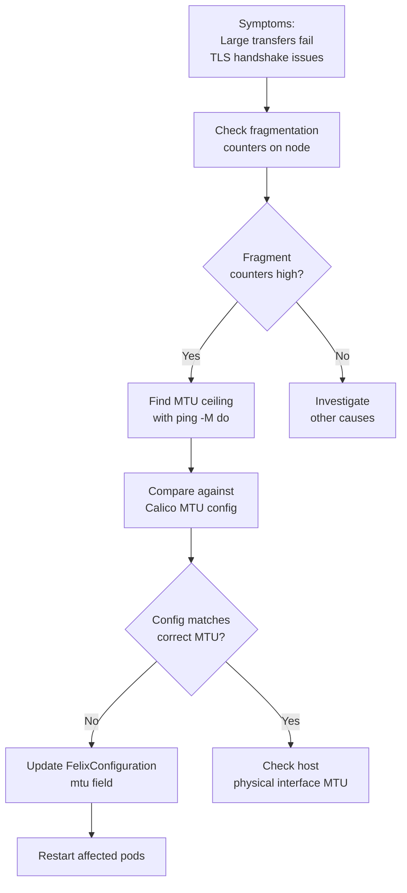

# How to Troubleshoot MTU Sizing for Calico

Author: [nawazdhandala](https://github.com/nawazdhandala)

Tags: Calico, Kubernetes, MTU, Networking, Troubleshooting

Description: Diagnose and fix MTU-related issues in Calico that cause packet fragmentation, silent connection failures, and degraded throughput in Kubernetes workloads.

---

## Introduction

MTU misconfigurations in Calico are notoriously difficult to diagnose because the symptoms are often indirect: TLS handshakes fail, HTTP connections drop after large responses, or gRPC streams silently fail after a few kilobytes. These failures occur because large packets that exceed the MTU get fragmented or dropped, but only in specific conditions that depend on packet size.

The classic symptom pattern is that small requests work fine while large downloads fail. This is because small packets (like a basic HTTP GET request) fit within the MTU, but large responses require packets near the MTU limit, and if the MTU is misconfigured those large packets get dropped.

## Prerequisites

- Access to node shell for network diagnostics
- kubectl exec access to pods
- tcpdump or wireshark for packet inspection

## Identify MTU Problems

Classic symptoms of MTU issues:

- Small HTTP requests work, but large responses fail
- SSH sessions work but scp/sftp hangs
- Container images fail to pull after initial layer
- gRPC connections drop after a few messages

```bash
# Check for large numbers of fragmented packets
netstat -s | grep -i fragment
cat /proc/net/snmp | awk '/IpFragCreates/{print "Fragments created:", $2}'
```

## Find the Actual MTU in Use

```bash
# Check what Calico thinks the MTU should be
kubectl get configmap -n kube-system calico-config -o yaml | grep mtu

# Check the actual pod interface MTU
kubectl exec <pod-name> -- ip link show eth0 | grep mtu

# Check the host interface MTU
ip link show | grep mtu
```

## Test for MTU Black Holes

Use progressively larger ping packets to find the MTU ceiling:

```bash
# Find the point of failure
for size in 1400 1420 1440 1450 1460 1470 1480 1490 1500; do
  result=$(kubectl exec test-pod -- ping -M do -s ${size} -c 1 -W 2 <peer-pod-ip> 2>&1)
  if echo "${result}" | grep -q "0 received\|Frag needed"; then
    echo "FAIL at size ${size}"
  else
    echo "OK at size ${size}"
  fi
done
```

## Fix MTU Configuration

After identifying the correct MTU, update Calico:

```bash
# For direct BGP routing (no encap)
calicoctl patch felixconfiguration default --type merge \
  --patch '{"spec":{"mtu":1500}}'

# For VXLAN (subtract 50 bytes for VXLAN header)
calicoctl patch felixconfiguration default --type merge \
  --patch '{"spec":{"vxlanMTU":1450}}'
```

Restart pods to pick up the new MTU:

```bash
kubectl rollout restart deployment -n <namespace>
```

## MTU Troubleshooting Flowchart



## Conclusion

MTU troubleshooting in Calico starts with identifying fragmentation counter spikes, then using binary search with DF-bit ping to find the actual MTU limit in the path. Once the correct MTU is identified, update the FelixConfiguration and restart pods to apply the new MTU value to pod interfaces. Document the correct MTU for your environment to prevent regressions after future changes.
