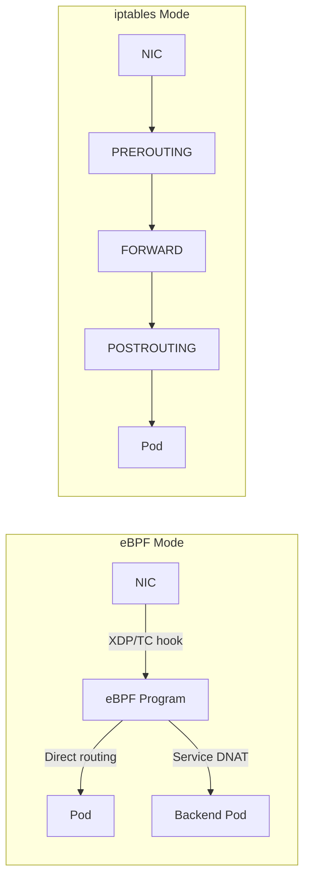

# How to Troubleshoot Native Routing with Calico eBPF

Author: [nawazdhandala](https://github.com/nawazdhandala)

Tags: Calico, Kubernetes, eBPF, Networking, Performance

Description: Diagnose native routing failures in Calico eBPF mode including map lookup errors, BPF program failures, and kernel compatibility issues.

---

## Introduction

Calico's eBPF dataplane provides native routing that bypasses much of the Linux kernel's traditional networking stack, resulting in significantly lower latency and higher throughput compared to the iptables-based dataplane. eBPF programs are loaded into the kernel and attached to networking hooks such as TC, performing routing decisions and policy enforcement without the overhead of traversing multiple iptables chains.

Native routing in eBPF mode eliminates the need for VXLAN or IP-in-IP encapsulation in many scenarios, as eBPF can directly program routes and perform NAT at packet arrival time. This makes it particularly valuable for latency-sensitive workloads and high-throughput microservices.

## Prerequisites

- Linux kernel 5.10+ for current Calico Open Source eBPF support, or Red Hat kernel 4.18.0-305+ with the required backports
- A current supported Calico release with eBPF dataplane support
- kube-proxy disabled or replaced by Calico eBPF
- kubectl and calicoctl access

## Enable eBPF Dataplane

```bash
# Disable kube-proxy before enabling eBPF

kubectl patch ds -n kube-system kube-proxy -p   '{"spec":{"template":{"spec":{"nodeSelector":{"non-calico":"true"}}}}}'

# Enable eBPF mode for manifest-based installations
calicoctl patch felixconfiguration default --type merge   --patch '{"spec":{"bpfEnabled":true}}'

# For operator-based installations, set the Linux dataplane to BPF
kubectl patch installation.operator.tigera.io default --type merge -p '{"spec":{"calicoNetwork":{"linuxDataplane":"BPF"}}}'
```

## Verify eBPF Mode

```bash
# Check eBPF programs loaded on a node
kubectl exec -n calico-system ds/calico-node -- bpftool prog list | grep calico

# Verify that service NAT entries are programmed by Calico's BPF dataplane
kubectl exec -n calico-system ds/calico-node -- calico-node -bpf nat dump

# For packet-level eBPF program logs, enable bpfLogLevel and read the trace log
calicoctl patch felixconfiguration default --type merge --patch '{"spec":{"bpfLogLevel":"Debug"}}'
kubectl exec -n calico-system ds/calico-node -- bpftool prog tracelog

# Test connectivity
kubectl run test1 --image=busybox -- sleep 3600
kubectl exec test1 -- wget -qO- --no-check-certificate https://kubernetes.default.svc/version
```

## Benchmark eBPF vs iptables

```bash
# Run throughput test
kubectl run iperf-server --image=networkstatic/iperf3 -- iperf3 -s
SRV=$(kubectl get pod iperf-server -o jsonpath='{.status.podIP}')
kubectl run iperf-client --image=networkstatic/iperf3 -- iperf3 -c ${SRV} -t 30

# Compare against previous iptables results
```

## eBPF Architecture



## Conclusion

Calico eBPF native routing delivers measurable performance improvements by bypassing traditional kernel networking overhead. Enable eBPF mode after verifying kernel compatibility, disable kube-proxy, and benchmark throughput and latency to validate the improvement. The migration is reversible - eBPF mode can be disabled and kube-proxy re-enabled if issues are encountered.
