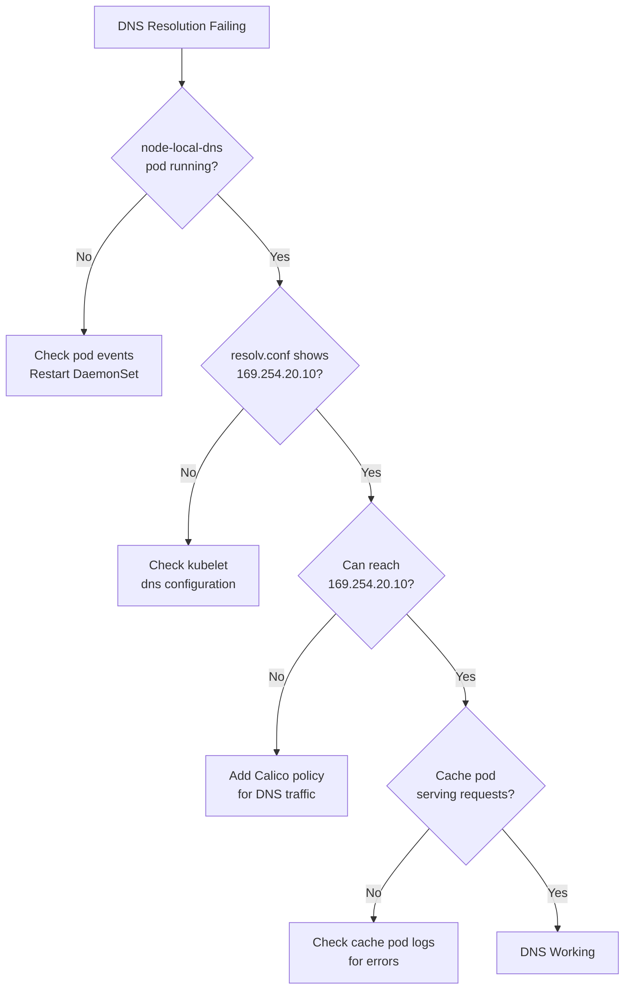

# How to Troubleshoot Node Local DNS Cache with Calico

Author: [nawazdhandala](https://github.com/nawazdhandala)

Tags: Calico, Kubernetes, DNS, Node-cache, Troubleshooting

Description: Diagnose and fix NodeLocal DNSCache issues in Calico clusters, including cache pod failures, policy conflicts, and DNS resolution failures affecting workloads.

---

## Introduction

NodeLocal DNSCache failures cause DNS resolution failures for all pods on the affected node, which manifests as application-level connection failures and timeout errors. Because DNS is used for almost every network connection in Kubernetes, a failed DNS cache pod can effectively take down all application pods on a node.

Common failure modes include: network policy blocking traffic to 169.254.20.10, the cache pod crashing due to iptables conflicts with Calico, or the cache falling back to CoreDNS due to connectivity issues. Troubleshooting requires checking both the DNS cache pod health and the Calico network policy configuration.

## Prerequisites

- kubectl access
- Access to node shell
- Understanding of NodeLocal DNSCache architecture

## Check DNS Cache Pod Status

```bash
kubectl get pods -n kube-system -l k8s-app=node-local-dns -o wide
kubectl describe pod -n kube-system -l k8s-app=node-local-dns | grep -A5 "Events:"
```

## Check DNS Resolution from a Pod

```bash
# Deploy debug pod on affected node
kubectl run dns-debug --image=busybox \
  --overrides='{"spec":{"nodeName":"affected-node"}}' -- sleep 3600

# Test DNS resolution
kubectl exec dns-debug -- nslookup kubernetes.default.svc.cluster.local
kubectl exec dns-debug -- nslookup kubernetes.default.svc.cluster.local 169.254.20.10
kubectl exec dns-debug -- nslookup google.com
```

## Check resolv.conf

```bash
kubectl exec dns-debug -- cat /etc/resolv.conf
# Should show: nameserver 169.254.20.10
# If it shows kube-dns ClusterIP, NodeLocal DNS is not active
```

## Diagnose Calico Policy Blocking DNS

```bash
# Check for denied traffic to 169.254.20.10
kubectl logs -n calico-system ds/calico-node | grep "169.254.20.10"

# Try pinging the DNS cache IP from pod
kubectl exec dns-debug -- ping -c 3 169.254.20.10

# Check iptables for any REJECT rules
iptables -L OUTPUT -n | grep "169.254"
```

## Check for iptables Conflicts

```bash
# NodeLocal DNS adds NOTRACK rules - check they exist
iptables -t raw -L OUTPUT -n | grep "169.254.20.10"
iptables -t nat -L OUTPUT -n | grep "169.254.20.10"
```

## Fix Common Issues

For Calico network policy blocking DNS:

```bash
calicoctl apply -f - <<EOF
apiVersion: projectcalico.org/v3
kind: GlobalNetworkPolicy
metadata:
  name: allow-nodelocal-dns-fix
spec:
  order: 5
  selector: all()
  types:
  - Egress
  egress:
  - action: Allow
    destination:
      nets: [169.254.20.10/32]
      ports: [53]
    protocol: UDP
  - action: Allow
    destination:
      nets: [169.254.20.10/32]
      ports: [53]
    protocol: TCP
EOF
```

## Troubleshooting Flowchart



## Conclusion

Troubleshooting NodeLocal DNSCache with Calico typically involves checking whether Calico network policies are blocking traffic to 169.254.20.10, verifying that iptables NOTRACK rules are in place for the DNS cache IP, and confirming the cache pod is healthy and serving requests. The most common fix is adding an explicit allow policy for UDP/TCP port 53 to the link-local DNS address.
