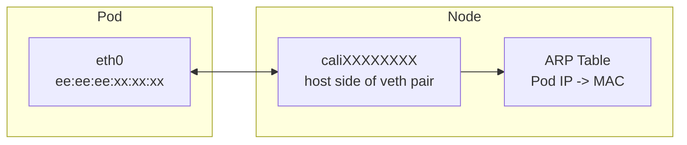

# How to Troubleshoot Pod MAC Addresses with Calico

Author: [nawazdhandala](https://github.com/nawazdhandala)

Tags: Calico, Kubernetes, MAC Address, Networking, CNI

Description: Diagnose MAC address conflicts and interface configuration issues in Calico that cause pod networking failures.

---

## Introduction

Calico connects pods to the node with virtual ethernet (veth) interfaces. On the host side, Calico may assign the same MAC address, `ee:ee:ee:ee:ee:ee`, to `cali*` interfaces because Calico uses point-to-point routed interfaces and does not rely on those MAC addresses for forwarding. Inside the pod, the `eth0` MAC address is isolated to the container network namespace and can be set explicitly when needed.

Understanding Calico's MAC address assignment is important for debugging layer-2 networking issues, configuring certain network security controls, and ensuring compatibility with network monitoring tools that track device identity by MAC address.

## Prerequisites

- Calico v3.20+ installed
- kubectl access to the cluster
- Access to node networking stack

## Check Pod MAC Addresses

```bash
# View MAC address of a pod interface

kubectl exec test-pod -- ip link show eth0

# View the corresponding veth on the host
ip link | grep -A1 cali

# Verify MAC address uniqueness across pods
kubectl get pods -A --no-headers | while read ns pod rest; do
  mac=$(kubectl exec -n "${ns}" "${pod}" -- ip -o link show eth0 2>/dev/null | grep -oE 'link/ether ([0-9a-f]{2}:){5}[0-9a-f]{2}' | awk '{print $2}')
  echo "${ns}/${pod}: ${mac}"
done | sort
```

## Configure Pod MAC Address

Calico allows configuring the MAC address visible inside a pod by adding the `cni.projectcalico.org/hwAddr` annotation before the pod is created:

```yaml
apiVersion: v1
kind: Pod
metadata:
  name: test-pod
  annotations:
    cni.projectcalico.org/hwAddr: "1c:0c:0a:c0:ff:ee"
spec:
  containers:
  - name: test
    image: busybox:1.36
    command: ["sleep", "3600"]
```

## Check for MAC Conflicts

```bash
# Look for duplicate MACs in the neighbor table
ip neigh show | awk '{print $5}' | grep -E '([0-9a-f]{2}:){5}[0-9a-f]{2}' | sort | uniq -d
```

## MAC Address Architecture



## Conclusion

Calico's host-side `cali*` interfaces can share the same MAC address because Calico routes traffic over point-to-point interfaces. Monitoring neighbor tables and understanding when to configure a pod's container-side MAC address helps diagnose layer-2 networking issues and configure security controls appropriately in your Kubernetes environment.
