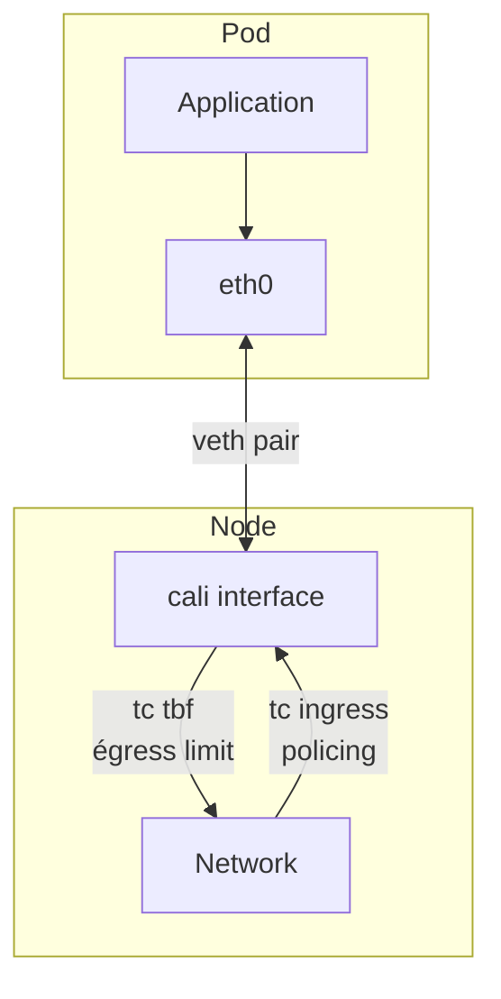

# How to Troubleshoot QoS Controls with Calico

Author: [nawazdhandala](https://github.com/nawazdhandala)

Tags: Calico, Kubernetes, QoS, Networking, Bandwidth

Description: Diagnose QoS configuration failures in Calico where bandwidth limits are not being applied or are causing unexpected packet drops.

---

## Introduction

Quality of Service (QoS) controls in Calico allow you to limit and prioritize pod network bandwidth to prevent noisy neighbors from consuming all available bandwidth and to ensure critical workloads receive the resources they need. Calico implements QoS using Linux traffic control (tc) to apply bandwidth limits to pod veth interfaces.

Pod bandwidth annotations provide a straightforward way to specify limits: annotate pods with the desired ingress and egress bandwidth limits, and Calico applies the corresponding tc rules when the pod interface is created. This integration with standard Kubernetes bandwidth annotations makes QoS configuration accessible without deep networking knowledge.

## Prerequisites

- Calico v3.20+ with bandwidth plugin enabled
- kubectl access
- iperf3 for testing (optional)

## Configure Pod Bandwidth Limits

Apply bandwidth limits using Kubernetes annotations on pods or deployment templates:

```yaml
apiVersion: v1
kind: Pod
metadata:
  name: bandwidth-limited-pod
  annotations:
    kubernetes.io/ingress-bandwidth: "10M"
    kubernetes.io/egress-bandwidth: "10M"
spec:
  containers:
  - name: app
    image: nginx
```

## Verify QoS Rules are Applied

```bash
# Find the pod's veth interface on the node
NODE=
POD_UID=

# List tc qdiscs on the calico interface
tc qdisc show dev cali<iface>
tc class show dev cali<iface>
```

## Test Bandwidth Limiting with iperf3

```bash
# Run iperf3 server
kubectl run iperf3-server --image=networkstatic/iperf3 -- iperf3 -s

# Run client with bandwidth-limited pod
SERVER_IP=$(kubectl get pod iperf3-server -o jsonpath='{.status.podIP}')
kubectl exec bandwidth-limited-pod -- iperf3 -c ${SERVER_IP} -t 10
# Expected: throughput limited to ~10 Mbps
```

## QoS Architecture



## Conclusion

Calico QoS controls using pod bandwidth annotations provide a simple, declarative way to limit network bandwidth per pod. The limits are enforced using Linux tc token bucket filters on the pod's veth interface. Test QoS limits with iperf3 to verify enforcement, and monitor tc statistics to track bandwidth utilization and drops caused by the limiting.
