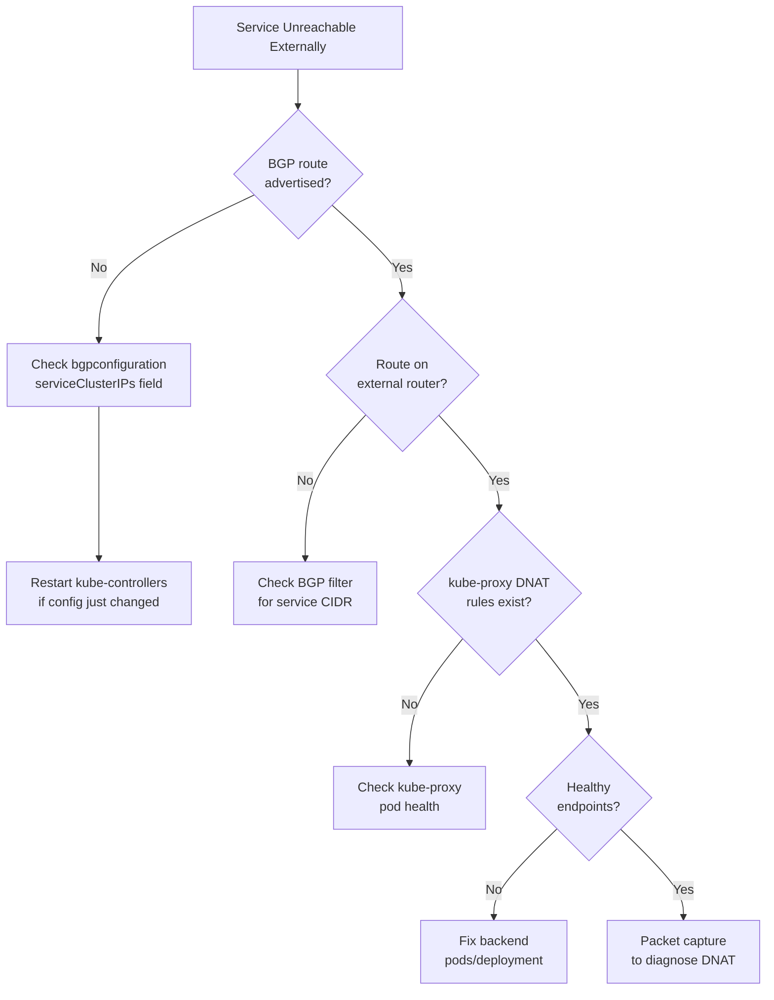

# How to Troubleshoot Service IP Advertisement with Calico

Author: [nawazdhandala](https://github.com/nawazdhandala)

Tags: Calico, Kubernetes, BGP, Service Advertisement, Troubleshooting

Description: Diagnose and fix Calico service IP advertisement failures, including missing BGP routes, kube-proxy forwarding issues, and asymmetric routing problems.

---

## Introduction

Service IP advertisement failures in Calico can manifest as services that are unreachable from outside the cluster despite BGP sessions being healthy. The problem could be at the BGP advertisement layer (routes not being announced), the data plane layer (kube-proxy not forwarding service traffic), or the network layer (asymmetric routing causing return traffic to be dropped).

Understanding the service traffic path is essential for effective troubleshooting: external traffic arrives at a node via the BGP-advertised service CIDR route, then kube-proxy (or Calico eBPF) performs DNAT to send it to a backend pod, and the response returns through the same or a different node depending on routing configuration.

## Prerequisites

- Calico with service advertisement configured
- `calicoctl`, `kubectl`, `iptables` access

## Check BGP Configuration for Service CIDRs

```bash
calicoctl get bgpconfiguration default -o yaml | grep -A10 serviceClusterIPs
calicoctl get bgpconfiguration default -o yaml | grep -A10 serviceLoadBalancerIPs
```

If service CIDRs are missing from the configuration, they won't be advertised:

```bash
# Add missing service CIDR
calicoctl patch bgpconfiguration default --type merge \
  --patch '{"spec":{"serviceClusterIPs":[{"cidr":"10.96.0.0/12"}]}}'
```

## Verify Calico kube-controllers is Running

Service advertisement is handled by calico-kube-controllers, not Felix:

```bash
kubectl get pods -n calico-system -l k8s-app=calico-kube-controllers
kubectl logs -n calico-system deployment/calico-kube-controllers | grep -i service
```

## Check Route Advertisement from Nodes

```bash
NODE_POD=$(kubectl get pod -n calico-system -l k8s-app=calico-node -o name | head -1)
kubectl exec -n calico-system ${NODE_POD} -- birdcl show route | grep -E "10.96|192.168.100"
```

If the service CIDR is not appearing in BIRD routes, check the Felix configuration:

```bash
kubectl exec -n calico-system ${NODE_POD} -- cat /etc/calico/felix.cfg
```

## Troubleshoot kube-proxy DNAT

Verify kube-proxy has loaded rules for the service:

```bash
SVC_IP=$(kubectl get svc my-service -o jsonpath='{.spec.clusterIP}')
iptables -t nat -L KUBE-SERVICES -n | grep ${SVC_IP}

# Check KUBE-SVC chain
CHAIN=$(iptables -t nat -L KUBE-SERVICES -n | grep ${SVC_IP} | awk '{print $3}')
iptables -t nat -L ${CHAIN} -n
```

## Check Endpoint Health

Service advertisement is only useful if backends are healthy:

```bash
kubectl get endpoints my-service
kubectl describe endpoints my-service
```

If no endpoints exist, the service has no healthy backends to forward to.

## Troubleshooting Flow



## Conclusion

Troubleshooting Calico service IP advertisement requires checking the BGP configuration for service CIDR entries, verifying calico-kube-controllers is running and programming routes into BIRD, confirming kube-proxy has DNAT rules for the service, and ensuring healthy backends exist. Work through these layers systematically to find where the service forwarding chain is broken.
