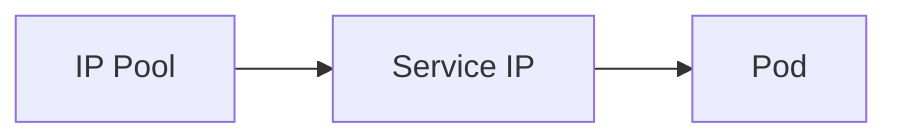

# How to Troubleshoot Service Load Balancer Addresses with Calico

Author: [nawazdhandala](https://github.com/nawazdhandala)

Tags: Calico, Kubernetes, LoadBalancer, IPAM, Networking

Description: Diagnose LoadBalancer IP assignment failures in Calico including pool exhaustion and BGP advertisement issues.

---

## Introduction

Service Load Balancer Addresses with Calico enables important networking capabilities in Calico Kubernetes clusters. Proper configuration ensures reliable service connectivity and IP address management.

## Prerequisites

- Calico v3.20+ installed
- kubectl and calicoctl access
- Cluster-admin access

## Configuration

```bash
calicoctl get ippools -o yaml
calicoctl get bgpconfiguration -o yaml
```

## Example Configuration

```yaml
apiVersion: projectcalico.org/v3
kind: IPPool
metadata:
  name: example-pool
spec:
  cidr: 10.48.0.0/16
  natOutgoing: true
```

## Verify

```bash
kubectl get svc -A
calicoctl ipam check
```

## Architecture



## Conclusion

How to Troubleshoot Service Load Balancer Addresses with Calico in Calico provides reliable IP addressing for Kubernetes services and workloads. Follow the configuration and verification steps to ensure correct behavior.
