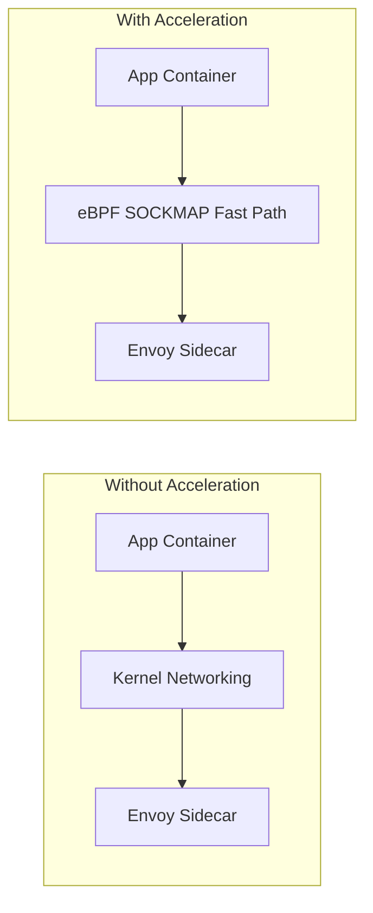

# How to Troubleshoot Sidecar Acceleration in Calico

Author: [nawazdhandala](https://github.com/nawazdhandala)

Tags: Calico, Kubernetes, eBPF, Sidecar, Service Mesh

Description: Diagnose sidecar acceleration issues in Calico eBPF mode including compatibility problems with specific service mesh implementations.

---

## Introduction

Calico's sidecar acceleration feature uses eBPF SOCKMAP to optimize traffic flows between an application and the Istio Envoy sidecar in the same pod. When pods use sidecar proxies like Envoy, network packets traverse multiple kernel networking layers. Calico can apply fast-path processing that reduces the overhead introduced by sidecar interception.

This can be an impactful performance optimization for microservices architectures that have adopted Istio, but Calico documents it as experimental and not production ready. Use it only in test environments until the technology is hardened for production security.

## Prerequisites

- Calico application layer policy enabled
- Linux kernel 4.19 or later on Calico nodes
- Istio with Envoy sidecar injection
- kubectl and calicoctl access

## Configure and Verify

```bash
# Enable sidecar acceleration

calicoctl patch felixconfiguration default \
  --patch '{"spec":{"sidecarAccelerationEnabled": true}}'

# Verify sidecar acceleration is enabled
calicoctl get felixconfiguration default -o yaml | grep sidecarAccelerationEnabled

# Verify the BPF dataplane components are running on a Calico node
kubectl logs -n calico-system ds/calico-node -c calico-node | \
  grep "BPF enabled, starting BPF endpoint manager and map manager"
```

## Benchmark Acceleration

```bash
# Compare latency with and without acceleration
# Without acceleration:
kubectl exec client-pod -- grpc_bench -n 10000 server:50051

# With acceleration enabled:
kubectl exec client-pod -- grpc_bench -n 10000 server:50051
```

## Monitoring

```bash
# Check Calico BPF counters on the relevant workload or host interface
kubectl exec -n calico-system <calico-node-pod> -- \
  calico-node -bpf counters dump --iface=<interface>
```

## Acceleration Flow



## Conclusion

How to Troubleshoot Sidecar Acceleration in Calico requires enabling the Felix sidecar acceleration setting and verifying that Istio sidecar traffic is being processed through the optimized eBPF path. Monitor latency metrics before and after enabling acceleration to quantify the performance improvement in your specific workload profile.
