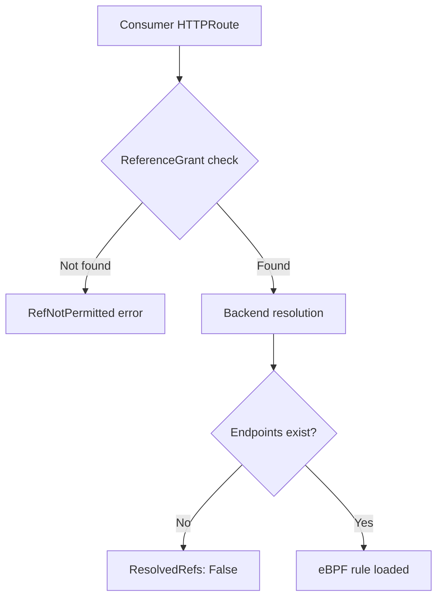

# How to Troubleshoot Types of GAMMA Configuration in the Cilium Gateway API

Author: [nawazdhandala](https://github.com/nawazdhandala)

Tags: Cilium, Kubernetes, GAMMA, Gateway API, Troubleshooting

Description: Diagnose issues with producer, consumer, and mixed GAMMA configuration types in Cilium including ReferenceGrant failures and route ownership conflicts.

---

## Introduction

Different GAMMA configuration types introduce distinct failure modes. Producer routes may fail when the Service selector does not match any backing pods. Consumer routes in cross-namespace configurations often fail due to missing or misconfigured ReferenceGrant resources. Mixed configurations can produce unexpected routing when both producer and consumer routes apply to the same traffic.

Diagnosing these issues requires inspecting route conditions at each stage of the Cilium reconciliation pipeline.

## Prerequisites

- Cilium with GAMMA enabled
- Multiple HTTPRoutes across namespaces
- `kubectl` CLI

## Troubleshoot Producer Route Failures

Check that the Service in the producer namespace has healthy endpoints:

```bash
kubectl get endpoints <service-name> -n <producer-ns>
```

Check the route's `ResolvedRefs` condition:

```bash
kubectl describe httproute <name> -n <producer-ns> | grep -A5 "ResolvedRefs"
```

## Troubleshoot Consumer Cross-Namespace Routes

Verify ReferenceGrant exists in the target namespace:

```bash
kubectl get referencegrant -n <target-ns>
```

If missing, consumer routes will show `RefNotPermitted`:

```bash
kubectl describe httproute <name> -n <consumer-ns> | grep "RefNotPermitted"
```

## Architecture



## Troubleshoot Route Priority Conflicts

When both producer and consumer routes apply to the same Service, check rule specificity. More specific matches (path, header) take priority:

```bash
kubectl get httproute -A -o yaml | grep -A5 "parentRef"
```

## Inspect Cilium Operator Logs

```bash
kubectl logs -n kube-system -l app.kubernetes.io/name=cilium-operator \
  --since=5m | grep -i "referencegrant\|httproute"
```

## Fix Missing Endpoints

If endpoints are empty, check the Service selector matches pod labels:

```bash
kubectl get pods -n <ns> --show-labels | grep <selector-key>
kubectl describe svc <service-name> -n <ns> | grep Selector
```

## Conclusion

Troubleshooting GAMMA configuration types requires checking ReferenceGrant permissions for cross-namespace routes, endpoint availability for backend resolution, and route specificity for conflict resolution. The Cilium operator logs provide detailed reconciliation errors for each failure mode.
