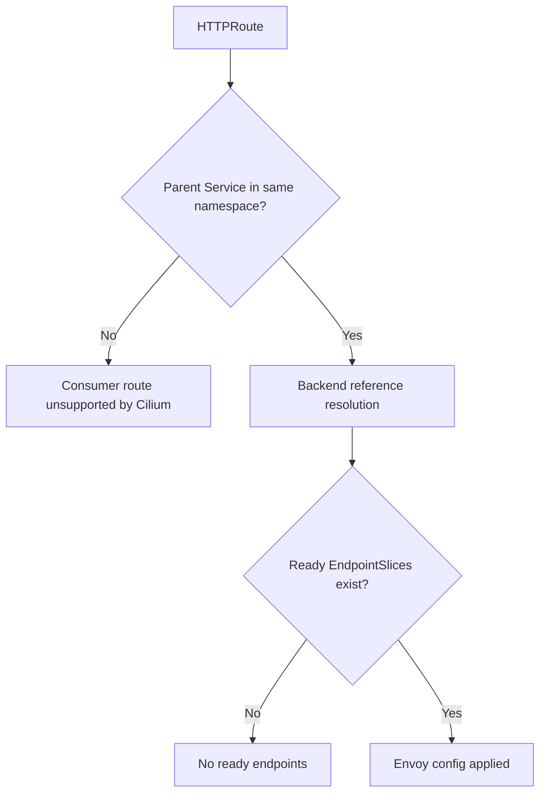

# How to Troubleshoot Types of GAMMA Configuration in the Cilium Gateway API

Author: [nawazdhandala](https://github.com/nawazdhandala)

Tags: Cilium, Kubernetes, GAMMA, Gateway API, Troubleshooting

Description: Diagnose issues with producer, consumer, and mixed GAMMA configuration types in Cilium including ReferenceGrant failures and route ownership conflicts.

---

## Introduction

Different GAMMA configuration types introduce distinct failure modes. Producer routes may fail to send traffic when the Service selector does not match any ready backing pods. Consumer routes are part of the GAMMA model, but Cilium currently supports only producer routes, so HTTPRoutes must be in the same namespace as the Service they bind to. Mixed configurations can produce unexpected routing when multiple producer routes apply to the same traffic.

Diagnosing these issues requires inspecting route conditions at each stage of the Cilium reconciliation pipeline.

## Prerequisites

- Cilium with GAMMA enabled
- Multiple HTTPRoutes across namespaces
- `kubectl` CLI

## Troubleshoot Producer Route Failures

Check that the Service in the producer namespace has healthy EndpointSlices:

```bash
kubectl get endpointslice -n <producer-ns> \
  -l kubernetes.io/service-name=<service-name>
```

Check the route's `Accepted` and `ResolvedRefs` conditions for route attachment and backend reference errors:

```bash
kubectl describe httproute <name> -n <producer-ns> | grep -A8 -E "Accepted|ResolvedRefs"
```

## Troubleshoot Consumer Cross-Namespace Routes

Cilium currently does not support consumer HTTPRoutes, so a route whose Service `parentRefs` points to a different namespace will not work as a Cilium GAMMA route. Confirm the parent reference namespace:

```bash
kubectl get httproute <name> -n <consumer-ns> -o yaml | grep -A6 "parentRefs:"
```

Move the HTTPRoute to the same namespace as the parent Service, or use a Gateway API mesh implementation that supports consumer routes. `ReferenceGrant` is still required for cross-namespace backend references, but it does not enable Cilium consumer route support:

```bash
kubectl get referencegrant -n <backend-ns>
```

## Architecture


```mermaid
flowchart TD
    A[HTTPRoute] --> B{Parent Service in same namespace?}
    B -->|No| C[Consumer route unsupported by Cilium]
    B -->|Yes| D[Backend reference resolution]
    D --> E{Ready EndpointSlices exist?}
    E -->|No| F[No ready endpoints]
    E -->|Yes| G[Envoy config applied]
```

## Troubleshoot Route Priority Conflicts

When multiple producer routes apply to the same Service, check rule specificity. More specific matches (path, header) take priority:

```bash
kubectl get httproute -A -o yaml | grep -A5 "parentRef"
```

## Inspect Cilium Operator Logs

```bash
kubectl logs -n kube-system deployments/cilium-operator \
  --since=5m | grep -i "referencegrant\|httproute"
```

## Fix Missing Endpoints

If EndpointSlices are empty, check the Service selector matches pod labels:

```bash
kubectl get pods -n <ns> --show-labels | grep <selector-key>
kubectl describe svc <service-name> -n <ns> | grep Selector
```

## Conclusion

Troubleshooting GAMMA configuration types in Cilium requires checking that routes bind to Services in the same namespace, ReferenceGrant permissions for cross-namespace backend references, endpoint availability for traffic forwarding, and route specificity for conflict resolution. The Cilium operator logs provide detailed reconciliation errors for each failure mode.
