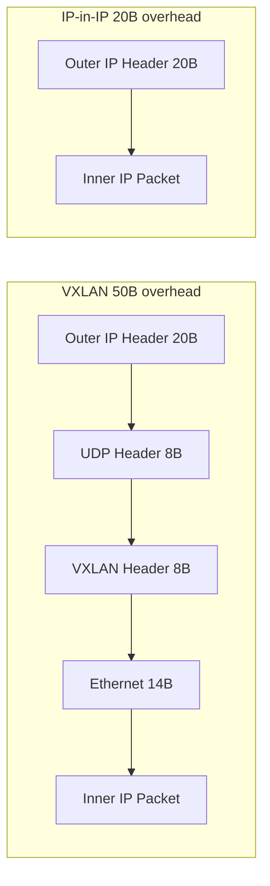

# How to Troubleshoot Performance Differences Between VXLAN and IP-in-IP in Calico

Author: [nawazdhandala](https://github.com/nawazdhandala)

Tags: Calico, Kubernetes, VXLAN, IP-in-IP, Encapsulation

Description: Identify and resolve performance issues when comparing VXLAN and IP-in-IP encapsulation in Calico deployments.

---

## Introduction

Choosing between VXLAN and IP-in-IP encapsulation in Calico is one of the most common architecture decisions when deploying Kubernetes networking. Both protocols solve the same problem - routing pod traffic across subnet boundaries - but with different tradeoffs in overhead, compatibility, and operational complexity.

VXLAN uses 50 bytes of overhead per packet (UDP + VXLAN headers) and operates on UDP port 4789. IP-in-IP uses only 20 bytes of overhead (an additional IP header) and operates as protocol 4. Both work on any IP network, but VXLAN is more likely to traverse NAT devices because it uses UDP, while IP-in-IP may be blocked by firewalls unfamiliar with protocol 4.

## Prerequisites

- Calico installed on Kubernetes
- Two or more nodes on different subnets
- iperf3 for benchmarking

## Compare Overhead

| Feature | VXLAN | IP-in-IP |
|---------|-------|----------|
| Overhead | 50 bytes | 20 bytes |
| Protocol | UDP 4789 | Protocol 4 |
| Windows support | Yes | No |
| Cloud NAT traversal | Better | Limited |
| CrossSubnet mode | Yes | Yes |

## Configure and Test VXLAN

```bash
# Switch to VXLAN
calicoctl patch ippool default-ipv4-ippool --type merge \
  --patch '{"spec":{"vxlanMode":"Always","ipipMode":"Never"}}'

# Benchmark with iperf3
kubectl run iperf-server --image=networkstatic/iperf3 -- iperf3 -s
SRV=$(kubectl get pod iperf-server -o jsonpath='{.status.podIP}')
kubectl run iperf-client --image=networkstatic/iperf3 \
  --overrides='{"spec":{"nodeName":"different-node"}}' \
  -- iperf3 -c ${SRV} -t 30 > vxlan-results.txt
```

## Configure and Test IP-in-IP

```bash
# Switch to IP-in-IP
calicoctl patch ippool default-ipv4-ippool --type merge \
  --patch '{"spec":{"ipipMode":"Always","vxlanMode":"Never"}}'

# Benchmark
kubectl run iperf-client2 --image=networkstatic/iperf3 \
  --overrides='{"spec":{"nodeName":"different-node"}}' \
  -- iperf3 -c ${SRV} -t 30 > ipip-results.txt

diff vxlan-results.txt ipip-results.txt
```

## Encapsulation Comparison



## Conclusion

Choose IP-in-IP when: all nodes are on Linux, protocol 4 is permitted by network security controls, and you want the lowest encapsulation overhead. Choose VXLAN when: Windows nodes are present, UDP-based traversal through NAT devices is needed, or your network security blocks protocol 4. For mixed environments, use CrossSubnet mode with your preferred protocol to minimize encapsulation for same-subnet traffic.
