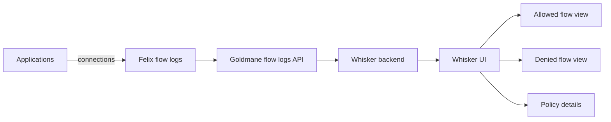

# How to Troubleshoot Whisker in Calico

Author: [nawazdhandala](https://github.com/nawazdhandala)

Tags: Calico, Kubernetes, Networking, Observability

Description: Diagnose and resolve Whisker deployment issues including pods not starting, no flow data appearing in the UI, and Whisker not reflecting current policy decisions.

---

## Introduction

Whisker troubleshooting focuses on two failure modes: the Whisker and Goldmane components not starting (usually RBAC, certificate, or resource constraints) and flow data not appearing in the UI (usually Goldmane not being enabled or a Felix flow log pipeline problem). Both are diagnosable through standard pod logs and Calico configuration inspection.

## Key Operations

```bash
# Verify Whisker is running

kubectl get pods -n calico-system | grep -E 'whisker|goldmane'

# Access Whisker UI
kubectl port-forward -n calico-system service/whisker 8081:8081
# Open: http://localhost:8081

# Check Whisker and Goldmane logs for issues
kubectl logs -n calico-system deployment/whisker --all-containers=true --tail=50
kubectl logs -n calico-system deployment/goldmane --all-containers=true --tail=50

# Check flow log configuration (affects what Whisker shows)
kubectl get felixconfiguration default -o jsonpath='{.spec.flowLogsFlushInterval}{"\n"}{.spec.flowLogsGoldmaneServer}{"\n"}'
```

## Architecture



## Common Whisker Queries

```plaintext
# In Whisker UI - common investigation patterns:

# Find all denied connections to a service:
# Filter: dest_name=<service-name>, action=deny

# Find all traffic from a specific pod:
# Filter: source_name=<pod-name>

# Find recently started connections:
# Sort by: start_time descending

# Find policy drop sources:
# Filter: action=deny, group by: source_namespace
```

## Conclusion

Whisker provides a fast path to understanding Calico network policy behavior in a running cluster. The denied flow view can replace hours of log analysis with seconds of UI interaction. Validate Whisker periodically by cross-checking its view against known application connection patterns - this ensures the observability pipeline is functioning correctly before you rely on it during an incident.
