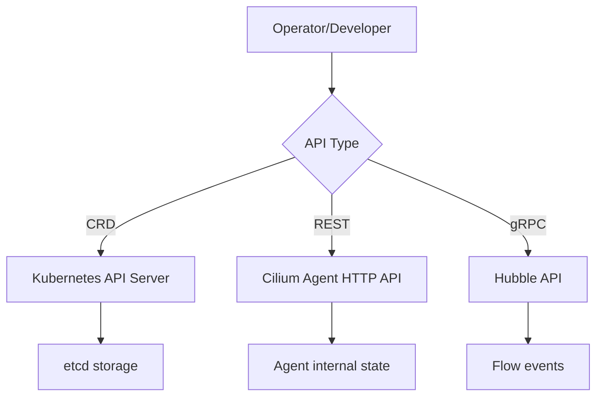

# How to Understand Cilium API Reference

Author: [nawazdhandala](https://github.com/nawazdhandala)

Tags: Cilium, Kubernetes, API, CRDs, Developer, Reference

Description: Understand the Cilium API reference including its REST API, custom resource definitions, and compatibility guarantees for building integrations.

---

## Introduction

Cilium exposes several APIs that operators and developers interact with: the Kubernetes CRD API for policy and configuration objects, the Cilium agent REST API for runtime state queries, and the Hubble gRPC API for flow observability. Understanding these APIs is essential for building automation, integrations, and monitoring systems.

The Cilium API reference documents all available CRDs (CiliumNetworkPolicy, CiliumEndpoint, CiliumNode, etc.), the agent REST endpoints, and the Hubble gRPC service definitions. API compatibility guarantees vary by component.

## Prerequisites

- Running Cilium cluster
- `kubectl` configured
- Basic familiarity with Kubernetes CRDs

## Cilium CRDs

View all Cilium CRDs:

```bash
kubectl get crd | grep cilium
```

Key CRDs include:

| CRD | Description |
|-----|-------------|
| `ciliumnetworkpolicies.cilium.io` | L3/L4/L7 network policies |
| `ciliumclusterwidenetworkpolicies.cilium.io` | Cluster-scoped policies |
| `ciliumendpoints.cilium.io` | Endpoint state per pod |
| `ciliumnodes.cilium.io` | Node networking state |
| `ciliumloadbalanceripools.cilium.io` | IP pools for LB |
| `ciliumbgppeerpolicies.cilium.io` | BGP peer configuration |

## Architecture



## Access the Agent REST API

The agent exposes a REST API on its local socket:

```bash
kubectl exec -n kube-system ds/cilium -- \
  curl -s --unix-socket /var/run/cilium/cilium.sock \
  http://localhost/v1/healthz | jq .
```

List endpoints via REST:

```bash
kubectl exec -n kube-system ds/cilium -- \
  curl -s --unix-socket /var/run/cilium/cilium.sock \
  http://localhost/v1/endpoint | jq '.[].id'
```

## View CRD Schema

```bash
kubectl explain ciliumnetworkpolicy.spec
kubectl explain ciliumnetworkpolicy.spec.egress
kubectl explain ciliumnetworkpolicy.spec.egress.toPorts
```

## API Compatibility Guarantees

- **CRD API**: Follows Kubernetes deprecation policy. Breaking changes include version bumps (v1 vs v2).
- **Agent REST API**: Versioned at `/v1/`. Breaking changes are avoided within a version.
- **Hubble gRPC**: Follows proto3 backward compatibility.

## Golang Client

For Go-based integrations, use the Cilium client package:

```go
import "github.com/cilium/cilium/pkg/client"

client, err := client.NewDefaultClient()
if err != nil { panic(err) }

endpoints, err := client.EndpointList()
```

## Conclusion

The Cilium API reference covers CRDs for Kubernetes-native configuration, the agent REST API for runtime state, and the Hubble gRPC API for observability. Understanding these APIs enables building robust automation and monitoring integrations that remain compatible across Cilium versions.
