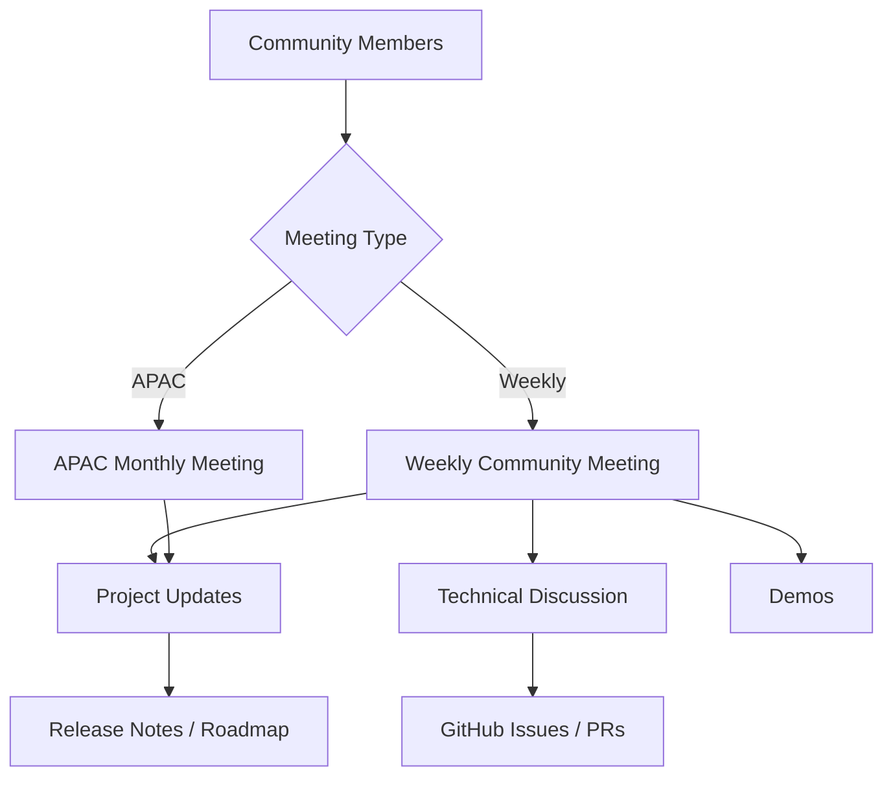

# How to Understand Community Meetings in the Cilium Project

Author: [nawazdhandala](https://github.com/nawazdhandala)

Tags: Cilium, Community, Open Source, Governance, Meetings

Description: Learn how Cilium's community meetings are structured, how to participate effectively, and how meetings connect to the project's development and governance processes.

---

## Introduction

The Cilium project runs several regular community meetings that provide forums for contributors, maintainers, and users to discuss development priorities, share roadmap updates, and coordinate on technical issues. Participating in these meetings is one of the best ways to stay current with Cilium's direction and to contribute to the project.

Community meetings are open to everyone. You do not need to be a code contributor to attend. Users sharing operational experiences, asking questions, or providing feedback are valuable participants who help shape Cilium's development.

## Meeting Types

### Weekly Community Meeting

The weekly meeting is the primary forum for Cilium development discussion:

- **Frequency**: Every week
- **Duration**: ~60 minutes
- **Format**: Open agenda, project updates, demos, and discussion
- **Access**: Zoom link published in the Cilium Slack `#community-meeting` channel

Agenda items are collected in the community meeting notes document linked from the Cilium website and GitHub.

### Monthly APAC Community Meeting

A dedicated meeting for contributors and users in APAC time zones:

- **Frequency**: Monthly
- **Focus**: Same content as weekly meeting, optimized for APAC time zones
- **Access**: Same Slack channel for announcements

## Architecture

## How to Participate

1. Join the Cilium Slack workspace at [slack.cilium.io](https://slack.cilium.io)
2. Subscribe to `#community-meeting` for meeting announcements
3. Review the agenda document before the meeting
4. Add agenda items at least 24 hours before the meeting

## Meeting Resources

| Resource | Location |
|----------|----------|
| Slack | slack.cilium.io |
| Meeting notes | Google Docs (linked from Slack) |
| YouTube recordings | Cilium YouTube channel |
| Calendar | cilium.io/community |

## Preparing for a Meeting

Before attending, review:

- Recent release notes for the current version
- Open RFCs or design documents under discussion
- Issues you want to raise with maintainers

## Conclusion

Cilium's community meetings are accessible, regular forums for both users and contributors. Attending the weekly meeting keeps you informed about project direction and provides direct access to the core team. The APAC meeting ensures global participation regardless of time zone.
