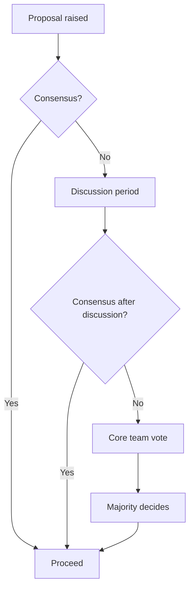

# How to Understand Cilium Governance

Author: [nawazdhandala](https://github.com/nawazdhandala)

Tags: Cilium, Community, Governance, Open Source, CNCF

Description: Understand the Cilium project's governance structure including committer roles, decision-making processes, and the CNCF relationship.

---

## Introduction

Cilium is a CNCF Graduated project with a well-defined governance model that describes how decisions are made, how contributors advance to committer status, and how the project is directed. Understanding this governance helps contributors know how to influence the project and how to resolve disagreements.

The Cilium governance model is documented in the GitHub repository and follows common CNCF governance patterns. It defines roles (contributor, committer, maintainer), how the core team is selected, and how technical disputes are resolved.

## Governance Roles

### Contributor

Anyone who submits code, documentation, or bug reports. No formal process required.

### Committer

Committers have write access to the repository and are trusted to review and merge contributions. Requirements:

- Sustained contributions over time
- Demonstrated technical expertise
- Nomination and approval by existing committers

### Maintainer (Core Team)

Maintainers set project direction, make architectural decisions, and represent Cilium in CNCF. The core team meets to make decisions that affect the project as a whole.

## Decision-Making



## CNCF Relationship

Cilium is a CNCF Graduated project, which means:

- Code and project assets are owned by the CNCF
- Cilium participates in CNCF governance bodies
- The project follows CNCF's Code of Conduct
- Isovalent (now part of Cisco) is the primary corporate contributor

## Contributing to Governance

- Governance documents are in `/GOVERNANCE.md` in the Cilium GitHub repository
- Changes to governance require a pull request and discussion
- Community members can propose governance changes through the weekly meeting

## Code of Conduct

Cilium follows the CNCF Code of Conduct. Reports of Code of Conduct violations can be made to the CNCF via the process described at: https://www.cncf.io/conduct/

## Find Current Maintainers

```bash
# In the Cilium GitHub repository
cat MAINTAINERS.md
```

Or view via GitHub:

```
https://github.com/cilium/cilium/blob/main/MAINTAINERS.md
```

## Conclusion

Cilium's governance model provides a transparent framework for contribution, committer advancement, and project decision-making. As a CNCF Graduated project, Cilium benefits from CNCF's neutral ownership and standardized governance practices. Understanding this model helps contributors engage effectively and advance within the project.
