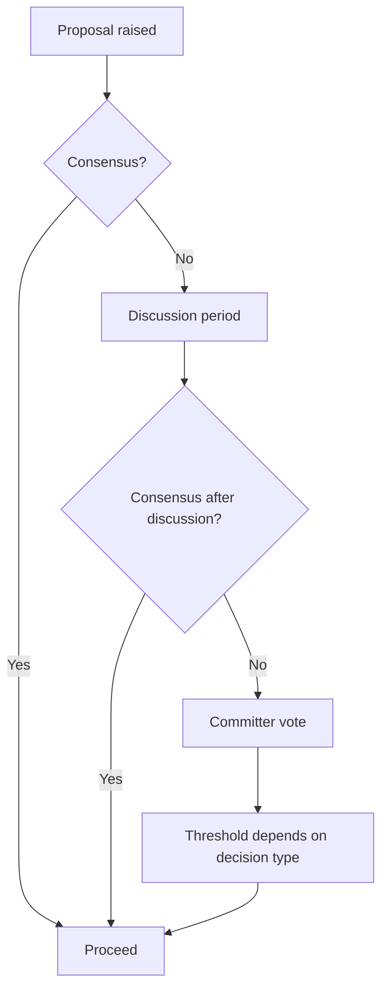

# How to Understand Cilium Governance

Author: [nawazdhandala](https://github.com/nawazdhandala)

Tags: Cilium, Community, Governance, Open Source, CNCF

Description: Understand the Cilium project's governance structure including committer roles, decision-making processes, and the CNCF relationship.

---

## Introduction

Cilium is a CNCF Graduated project with a well-defined governance model that describes how decisions are made, how contributors advance to committer status, and how the project is directed. Understanding this governance helps contributors know how to influence the project and how to resolve disagreements.

The Cilium governance model is documented in the Cilium community GitHub repository and follows common CNCF governance patterns. It defines a contributor ladder, how commit access is granted or revoked, and how technical disputes are resolved.

## Governance Roles

### Contributor

Anyone who submits code, documentation, or bug reports. No formal process required.

### Committer

Committers have write access to the repository and are trusted to review and merge contributions. Requirements:

- Sustained contributions over time
- Demonstrated technical expertise
- Nomination and approval by existing committers, including a majority of yes votes and no no votes

### Committer and CNCF Maintainer Status

Cilium committers discuss strategy and policy for the whole project, vote on project matters when required, and can communicate with the CNCF on behalf of the project. Becoming a Cilium committer also grants CNCF maintainer status for the project.

## Decision-Making


```mermaid
flowchart TD
    A[Proposal raised] --> B{Consensus?}
    B -->|Yes| C[Proceed]
    B -->|No| D[Discussion period]
    D --> E{Consensus after discussion?}
    E -->|Yes| C
    E -->|No| F[Committer vote]
    F --> G[Threshold depends on decision type]
    G --> C
```

## CNCF Relationship

Cilium is a CNCF Graduated project, which means:

- Cilium is hosted by the CNCF as a graduated project
- Cilium committers can request CNCF project services and vote on certain CNCF matters
- The project follows CNCF's Code of Conduct
- Isovalent (now part of Cisco) is the primary corporate contributor

## Contributing to Governance

- Governance documents are in `/GOVERNANCE.md` in the Cilium community GitHub repository
- Changes to governance require discussion and, except for editorial changes, a committer vote
- Community members can raise governance topics through Cilium community channels and meetings

## Code of Conduct

Cilium's Code of Conduct is based on the CNCF Code of Conduct and includes Cilium-specific reporting details. Reports of Code of Conduct violations can be made to the Cilium code of conduct team or, where applicable, through the CNCF process described at: https://www.cncf.io/conduct/

## Find Current Maintainers

```bash
# In the Cilium GitHub repository

cat MAINTAINERS.md
```

Or view via GitHub:

```plaintext
https://github.com/cilium/cilium/blob/main/MAINTAINERS.md
```

## Conclusion

Cilium's governance model provides a transparent framework for contribution, committer advancement, and project decision-making. As a CNCF Graduated project, Cilium benefits from CNCF's neutral project home and standardized governance practices. Understanding this model helps contributors engage effectively and advance within the project.
