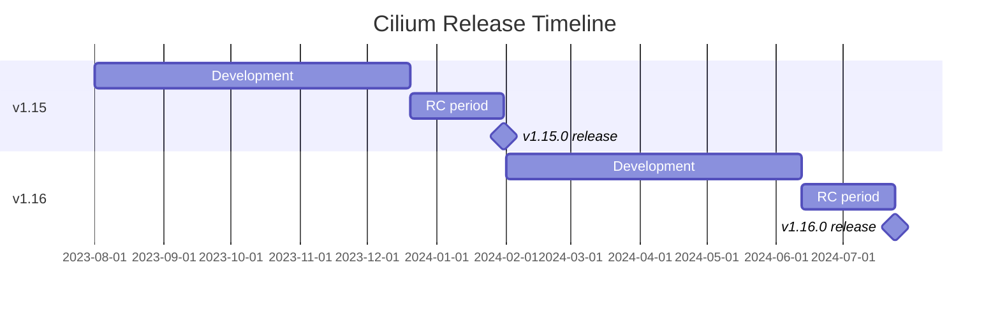

# How to Understand Release Cadence in the Cilium Project

Author: [nawazdhandala](https://github.com/nawazdhandala)

Tags: Cilium, Community, Release, Versioning, Open Source

Description: Understand Cilium's release cadence, versioning scheme, stable branch lifecycle, and how to plan cluster upgrades around release schedules.

---

## Introduction

Cilium follows a predictable release cadence that helps operators plan upgrades and understand support timelines. The project targets feature releases around every six months and periodic patch releases for maintained stable branches.

Understanding this cadence is essential for maintaining a secure and current Cilium deployment. Falling too far behind means missing security patches and bug fixes that may affect your cluster's stability.

## Release Versioning

Cilium uses an `X.Y.Z` version format:

- **Minor releases** (e.g., 1.15.0, 1.16.0): New features, may include upgrade-impacting changes
- **Patch releases** (e.g., 1.15.1, 1.15.2): Bug fixes, security patches, and other backported maintenance changes
- **Release candidates** (e.g., v1.16.0-rc.0): Pre-release testing

## Release Cadence

| Release Type | Frequency | Content |
|--------------|-----------|---------|
| Minor release | Around every six months | New features, API changes |
| Patch release | Periodic, often around the middle of the month for maintained branches | Bugs, CVEs, maintenance fixes |
| RC cycle | Starts after feature freeze, around six weeks before the target minor release | Feature freeze, testing |

## Architecture



## Stable Branch Maintenance

The Cilium community maintains stable releases for the latest three minor versions. The current minor release generally receives all bug fixes that meet the backport criteria, while the previous two minor versions receive security-relevant fixes, major bug fixes relevant to correct operation, debug tool improvements, and applicable documentation updates.

Check which versions are currently maintained:

```bash
# Visit: https://github.com/cilium/cilium

# Maintained stable releases are listed in the repository README
```

## Planning Upgrades

Best practices for staying current:

1. Track releases in Cilium Slack `#release` channel
2. Test minor upgrades in staging before production
3. Plan upgrades one minor release at a time
4. Apply patch releases promptly (especially CVE patches)

## Check Your Current Version

```bash
cilium version
kubectl exec -n kube-system ds/cilium -- cilium-dbg version
```

## Subscribe to Release Notifications

- Watch the GitHub repository for release events
- Join the `#release` Slack channel for release announcements
- Follow the Cilium community page for current communication channels

## Upgrade Timing

When a new minor release is available:

```bash
# Check the upgrade guide first
# https://docs.cilium.io/en/stable/operations/upgrade/

# Follow the standard upgrade process
helm upgrade cilium cilium/cilium \
  --namespace kube-system \
  --version <new-version> \
  -f my-values.yaml
```

## Conclusion

Cilium's predictable six-month feature release cadence and maintained stable branches give operators a clear framework for planning upgrades. Staying current with minor releases ensures access to new features and security patches, while patch releases provide a stable path for production deployments.
