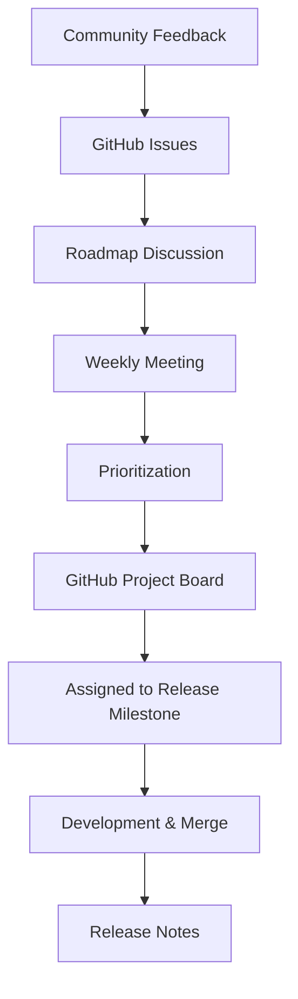

# How to Understand the Cilium Roadmap

Author: [nawazdhandala](https://github.com/nawazdhandala)

Tags: Cilium, Community, Roadmap, Open Source, Planning

Description: Learn how to read and interpret the Cilium project roadmap, where to find upcoming feature plans, and how to influence roadmap priorities.

---

## Introduction

The Cilium roadmap communicates the project's development priorities and planned features for upcoming releases. Understanding the roadmap helps users plan upgrades, anticipate breaking changes, and identify opportunities to contribute to features they care about.

The Cilium roadmap is maintained in GitHub and discussed openly in community meetings. Unlike commercial product roadmaps, it represents community intentions rather than commitments, and priorities can shift based on contributor availability and user feedback.

## Where to Find the Roadmap

| Location | Content |
|----------|---------|
| GitHub Projects (cilium/cilium) | Release planning boards |
| GitHub Issues with `roadmap` label | Feature requests and tracking issues |
| Weekly community meeting notes | Current sprint priorities |
| Cilium blog | Feature announcements and previews |

## How to Read GitHub Projects

The main Cilium GitHub project board organizes work by:

1. **Backlog**: Planned but not yet scheduled
2. **In Progress**: Active development
3. **Done**: Completed in the current cycle

```bash
# View issues labeled roadmap
# Visit: https://github.com/cilium/cilium/issues?q=label:roadmap
```

## Architecture



## Key Roadmap Categories

Cilium roadmap items typically fall into:

- **eBPF Datapath**: New kernel features, performance optimizations
- **Policy**: New policy types, L7 protocol support
- **Observability**: Hubble enhancements, metrics
- **Cluster Mesh**: Multi-cluster improvements
- **Gateway API**: New features following upstream spec
- **IPAM**: IP address management improvements
- **Scalability**: Large-cluster performance

## How to Influence the Roadmap

1. **File detailed GitHub issues** describing the use case and impact
2. **Attend weekly community meetings** and raise the topic
3. **Submit an RFC** for significant feature proposals
4. **Contribute code** - roadmap items with contributors advance faster

## Tracking Specific Features

Subscribe to a GitHub issue to receive notifications when it progresses:

```plaintext
https://github.com/cilium/cilium/issues/<issue-number>
```

Use GitHub's "Watch" feature on the repository for all release announcements.

## Conclusion

The Cilium roadmap is maintained transparently in GitHub and discussed weekly in community meetings. Following the project board, labelled issues, and release milestones keeps you informed about upcoming features and breaking changes. Active participation in community discussions is the most effective way to influence roadmap priorities.
