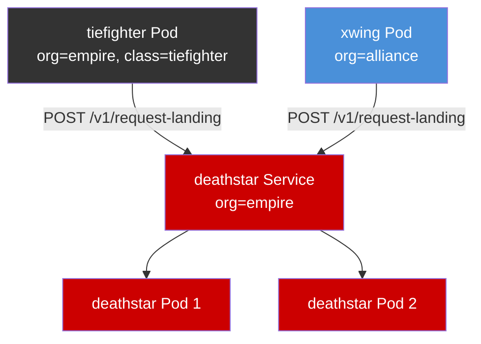

# Understanding the Cilium Star Wars Demo

Author: [nawazdhandala](https://github.com/nawazdhandala)

Tags: Cilium, Kubernetes, eBPF, Networking, Network Policy, Star Wars Demo

Description: A comprehensive overview of the Cilium Star Wars demo and what it teaches about eBPF-based network policy enforcement in Kubernetes.

---

## Introduction

The Cilium Star Wars demo is one of the most illustrative examples in the cloud-native networking world. It uses a fictional Star Wars scenario — the Galactic Empire attempting to communicate with the Death Star — to demonstrate how Cilium enforces network policies at Layer 3, Layer 4, and Layer 7 using eBPF. Rather than dry networking concepts, the demo places policy enforcement in a narrative context that makes the concepts immediately tangible.

Cilium is a CNI (Container Network Interface) plugin for Kubernetes that leverages eBPF (extended Berkeley Packet Filter) to provide high-performance, observable, and secure networking. eBPF allows Cilium to run programs directly in the Linux kernel without kernel modifications, enabling dynamic insertion of network policies at runtime. The Star Wars demo showcases this power in a hands-on, exploratory way.

Understanding the demo means understanding the core thesis of Cilium: that network security should be identity-aware, not just IP-address-aware. In a cloud-native world where IPs are ephemeral and pods are constantly rescheduled, policies tied to workload identity — expressed via Kubernetes labels — are far more robust and expressive than traditional firewall rules.

## Prerequisites

- A running Kubernetes cluster (minikube, kind, or a cloud cluster)
- `kubectl` installed and configured
- Cilium installed on the cluster
- Basic familiarity with Kubernetes Pods and Services

## Overview of the Demo Architecture

The Star Wars demo deploys the following components:



The key insight is that without any policy, both the `tiefighter` (Empire) and `xwing` (Alliance) can reach the Death Star. The demo proceeds to show how Cilium policies restrict this access — first at L3/L4, then with HTTP-aware L7 rules.

## Deploying the Star Wars Demo

```bash
# Apply the Star Wars demo manifests
kubectl create -f https://raw.githubusercontent.com/cilium/cilium/HEAD/examples/minikube/http-sw-app.yaml

# Verify the pods are running
kubectl get pods -l org=empire
kubectl get pods -l org=alliance

# Check the deathstar service
kubectl get svc deathstar
```

## What the Demo Teaches

The Star Wars demo covers four progressive stages of policy enforcement:

1. **No policy (open access)** — All pods can reach the Death Star
2. **L3/L4 policy** — Only Empire pods can reach the Death Star
3. **L7 HTTP policy** — Even Empire pods can only call permitted HTTP endpoints
4. **Identity-based enforcement** — Policies follow workload identity, not IPs

```bash
# Test open access (before any policy)
kubectl exec tiefighter -- curl -s -XPOST deathstar.default.svc.cluster.local/v1/request-landing
kubectl exec xwing -- curl -s -XPOST deathstar.default.svc.cluster.local/v1/request-landing
```

## Key Cilium Concepts Illustrated

The demo introduces the `CiliumNetworkPolicy` CRD, which extends the standard Kubernetes `NetworkPolicy` with L7 awareness. Labels like `io.cilium.k8s.policy.cluster`, `io.kubernetes.pod.namespace`, and user-defined labels like `org=empire` form the foundation of identity-based selection.

```yaml
# Example label selector used in the demo
endpointSelector:
  matchLabels:
    org: empire
    class: deathstar
```

## Conclusion

The Cilium Star Wars demo is an elegant introduction to identity-based network policy in Kubernetes. By working through the demo, you gain an intuitive understanding of how eBPF enables Cilium to enforce policies without the fragility of IP-based rules. It demonstrates that real-world microservice security requires more than port-based firewalls — it requires understanding application-layer intent, which is exactly what Cilium delivers.
