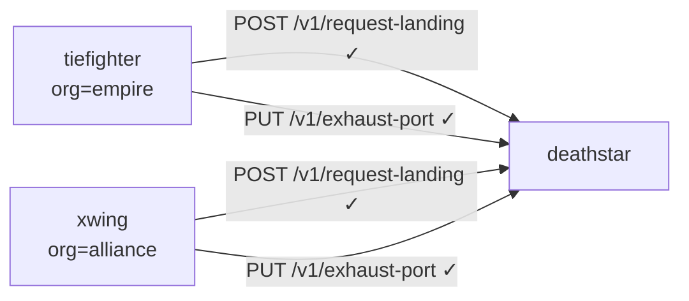

# Understanding Current Access in the Cilium Star Wars Demo

Author: [nawazdhandala](https://github.com/nawazdhandala)

Tags: Cilium, Kubernetes, eBPF, Network Policy, Star Wars Demo

Description: Understand what 'current access' means in the Cilium Star Wars demo and why observing open access before applying policy is an essential step in any security hardening workflow.

---

## Introduction

Before applying any Cilium network policy, the Star Wars demo starts from a state of fully open access. Every pod can reach every other pod. The `xwing`, despite belonging to the enemy Alliance, can request a landing on the Death Star just as easily as an authorized TIE Fighter can. This initial state is not a failure - it is a deliberately constructed baseline that exposes a universal truth about Kubernetes networking: by default, all pods can communicate with all other pods.

Understanding the "current access" phase of the demo means understanding the Kubernetes networking model. Kubernetes implements a flat, routable network where every pod has a unique IP address and can communicate with every other pod by default, regardless of namespace, label, or ownership. No implicit deny exists in the Kubernetes networking model. All deny rules must be explicitly created.

This is a significant security concern for production environments. Most Kubernetes clusters start with no `NetworkPolicy` resources, meaning every service is accessible from every other service. The Star Wars demo makes this visible and visceral before introducing Cilium's policy capabilities.

## Prerequisites

- Star Wars demo deployed
- No `CiliumNetworkPolicy` or `NetworkPolicy` resources applied yet
- `kubectl` configured

## Observing Open Access

```bash
# Confirm no policies are currently active
kubectl get networkpolicies
kubectl get ciliumnetworkpolicies

# Test Empire ship - should succeed
kubectl exec tiefighter -- curl -s -XPOST deathstar.default.svc.cluster.local/v1/request-landing

# Test Alliance ship - should also succeed (no policy yet)
kubectl exec xwing -- curl -s -XPOST deathstar.default.svc.cluster.local/v1/request-landing

# Test dangerous endpoint - open to all
kubectl exec tiefighter -- curl -s -XPUT deathstar.default.svc.cluster.local/v1/exhaust-port
kubectl exec xwing -- curl -s -XPUT deathstar.default.svc.cluster.local/v1/exhaust-port
```

All four commands return success. This is the problem statement.

## Visualizing the Open Access State



## Why Open Access Is the Kubernetes Default

Kubernetes was designed for connectivity, not isolation. The network model guarantees that any pod can reach any service IP. `NetworkPolicy` is an opt-in restriction layer. This design makes Kubernetes easy to get started with but requires deliberate effort to secure.

```bash
# Verify pod-to-pod connectivity directly
TF_IP=$(kubectl get pod tiefighter -o jsonpath='{.status.podIP}')
DS_IP=$(kubectl get pod -l class=deathstar -o jsonpath='{.items[0].status.podIP}')

echo "TIE Fighter IP: $TF_IP"
echo "Death Star IP: $DS_IP"

# Direct pod-to-pod communication works without any service
kubectl exec xwing -- curl -s -XPOST http://$DS_IP/v1/request-landing
```

## Mapping to Production Risk

| Demo Risk | Production Equivalent |
|-----------|----------------------|
| xwing reaches deathstar | External service reaches internal API |
| Anyone hits exhaust-port | Any pod calls /admin endpoint |
| No visibility into traffic | No audit log of service-to-service calls |

## Conclusion

The current access phase of the Cilium Star Wars demo is a powerful teaching moment. It shows that the default Kubernetes network model is permissive, that this permissiveness has real security implications, and that the solution requires explicitly defined policy. By understanding this baseline, you understand why Cilium's network policy capabilities are not optional niceties but essential security infrastructure.
