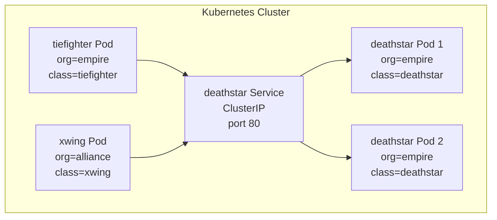

# Understanding the Demo Application in the Cilium Star Wars Demo

Author: [nawazdhandala](https://github.com/nawazdhandala)

Tags: Cilium, Kubernetes, eBPF, Network Policy, Star Wars Demo

Description: A detailed look at the application components deployed in the Cilium Star Wars demo and how they represent real-world microservice patterns.

---

## Introduction

Before diving into network policies, it is essential to understand what the Cilium Star Wars demo actually deploys. The application consists of four Kubernetes workloads representing elements of the Star Wars universe: the Death Star (a service accepting landing requests), TIE Fighters (Empire ships), and X-Wings (Rebel Alliance ships). Each workload carries carefully chosen Kubernetes labels that become the foundation for all policy decisions Cilium makes.

The demo application is intentionally simple - it is an HTTP server with a handful of endpoints, not a complex distributed system. But its simplicity is a feature, not a limitation. By keeping the application logic minimal, the demo keeps your attention on the networking layer rather than the application layer. The labels on the pods are the application, from Cilium's perspective.

Understanding the architecture of the demo application also helps you map its patterns to your own services. The `deathstar` represents any sensitive internal service. The `tiefighter` represents an authorized client. The `xwing` represents an unauthorized external actor. This mapping applies directly to real-world API gateway patterns, internal microservice communication, and zero-trust architecture.

## Prerequisites

- `kubectl` installed and configured
- A Kubernetes cluster with Cilium installed

## Application Components



## Inspecting the Deployed Resources

```bash
# Deploy the demo
kubectl create -f https://raw.githubusercontent.com/cilium/cilium/HEAD/examples/minikube/http-sw-app.yaml

# Inspect all pods and their labels
kubectl get pods --show-labels

# Inspect the deathstar deployment
kubectl describe deployment deathstar

# Inspect the service
kubectl describe svc deathstar
```

## The Deathstar HTTP API

The `deathstar` pod runs a simple HTTP server with these endpoints:

| Method | Path | Description |
|--------|------|-------------|
| POST | /v1/request-landing | Request permission to land |
| PUT | /v1/exhaust-port | Trigger the exhaust port (dangerous!) |
| GET | /v1/health | Health check |

```bash
# Explore the API from within the cluster
kubectl exec tiefighter -- curl -s http://deathstar.default.svc.cluster.local/v1/health

# Request landing
kubectl exec tiefighter -- curl -s -XPOST deathstar.default.svc.cluster.local/v1/request-landing

# The dangerous exhaust port endpoint
kubectl exec tiefighter -- curl -s -XPUT deathstar.default.svc.cluster.local/v1/exhaust-port
```

## Label Schema

The label schema is the policy foundation:

```yaml
# tiefighter labels
labels:
  org: empire
  class: tiefighter

# xwing labels
labels:
  org: alliance
  class: xwing

# deathstar labels
labels:
  org: empire
  class: deathstar
```

These labels are used verbatim in `CiliumNetworkPolicy` selectors. This direct correspondence between application metadata and security policy is the essence of identity-based networking.

## Mapping to Real-World Services

| Demo Component | Real-World Equivalent |
|---------------|----------------------|
| `deathstar` | Internal API service (payments, auth) |
| `tiefighter` | Authorized microservice client |
| `xwing` | External/untrusted client |
| `org=empire` label | Service mesh namespace or team label |
| `/v1/exhaust-port` | Privileged admin endpoint |

## Conclusion

The demo application in the Cilium Star Wars demo is a minimal but perfectly structured representation of a real-world microservice security problem. By studying its components, labels, and API surface, you gain a template for applying the same patterns to production environments. The labels are the policy handles - every label you put on a pod is a potential security boundary you can enforce with Cilium.
