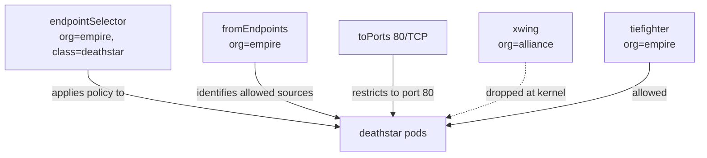

# Understanding L3/L4 Policy in the Cilium Star Wars Demo

Author: [nawazdhandala](https://github.com/nawazdhandala)

Tags: Cilium, Kubernetes, eBPF, Networking, Network Policy, L3/L4

Description: Understand how Layer 3 and Layer 4 network policies work in Cilium and how the Star Wars demo illustrates their application and limitations.

---

## Introduction

Layer 3 (L3) and Layer 4 (L4) network policies form the foundation of Kubernetes network security. L3 policies operate on IP addresses and network identities, controlling which endpoints can communicate. L4 policies add port-level granularity, restricting which protocols and port numbers are accessible. Together, L3/L4 policies answer the question: "Can endpoint A establish a connection to endpoint B on port P?"

In the Cilium Star Wars demo, the first policy applied is an L3/L4 policy that restricts access to the `deathstar` service so only pods with the `org=empire` label can reach it on port 80. This immediately blocks the `xwing` from landing on the Death Star. Understanding this policy means understanding how Cilium translates Kubernetes labels into kernel-enforced identity rules using eBPF maps.

The L3/L4 policy stage of the demo is also where the limitation of connection-level policies becomes visible. While the `xwing` is now blocked, the `tiefighter` can still call any HTTP endpoint on the `deathstar`, including the dangerous `/v1/exhaust-port`. This sets up the need for L7 policy in the next stage.

## Prerequisites

- Star Wars demo deployed
- Cilium installed as CNI
- Familiarity with CiliumNetworkPolicy basics

## The L3/L4 Policy Resource

```yaml
# sw_l3_l4_policy.yaml
apiVersion: "cilium.io/v2"
kind: CiliumNetworkPolicy
metadata:
  name: "rule1"
spec:
  description: "L3-L4 policy to restrict deathstar access to empire ships"
  endpointSelector:
    matchLabels:
      org: empire
      class: deathstar
  ingress:
  - fromEndpoints:
    - matchLabels:
        org: empire
    toPorts:
    - ports:
      - port: "80"
        protocol: TCP
```

## Policy Components Explained



## Applying and Verifying the Policy

```bash
# Apply the L3/L4 policy
kubectl create -f https://raw.githubusercontent.com/cilium/cilium/HEAD/examples/minikube/sw_l3_l4_policy.yaml

# Verify policy is active
kubectl get CiliumNetworkPolicy rule1 -o yaml

# Check Cilium has loaded the policy
kubectl exec -n kube-system ds/cilium -- cilium policy get

# Test: Empire ship should succeed
kubectl exec tiefighter -- curl -s -XPOST deathstar.default.svc.cluster.local/v1/request-landing

# Test: Alliance ship should be blocked (connection dropped)
kubectl exec xwing -- curl -s --max-time 5 -XPOST deathstar.default.svc.cluster.local/v1/request-landing
echo "Exit code: $?"
```

## How Cilium Enforces L3/L4 in the Kernel

When the policy is applied, Cilium:

1. Assigns security identities to all endpoints based on their labels
2. Populates eBPF policy maps with allow/deny rules keyed by identity pair
3. At packet time, the TC hook looks up `(source_identity, dest_identity, port)` in the BPF map
4. The verdict (allow/drop) is applied inline without going to userspace

```bash
# Inspect BPF policy maps
kubectl exec -n kube-system ds/cilium -- cilium bpf policy get --all

# View drop statistics
kubectl exec -n kube-system ds/cilium -- cilium metrics list | grep drop
```

## The Limitation: L3/L4 Cannot Inspect HTTP Content

```bash
# This is still allowed even with L3/L4 policy:
kubectl exec tiefighter -- curl -s -XPUT deathstar.default.svc.cluster.local/v1/exhaust-port
# Returns success! L3/L4 only cares about the TCP connection, not the HTTP path.
```

## Conclusion

The L3/L4 policy in the Cilium Star Wars demo achieves significant access control: unauthorized pods cannot connect at all. But it reveals the fundamental limitation of connection-level policies — once a connection is established, any HTTP method and path is reachable. This is why the demo progresses to L7 policy in its next stage, and why a complete microservice security strategy requires both L3/L4 and L7 policy enforcement.
