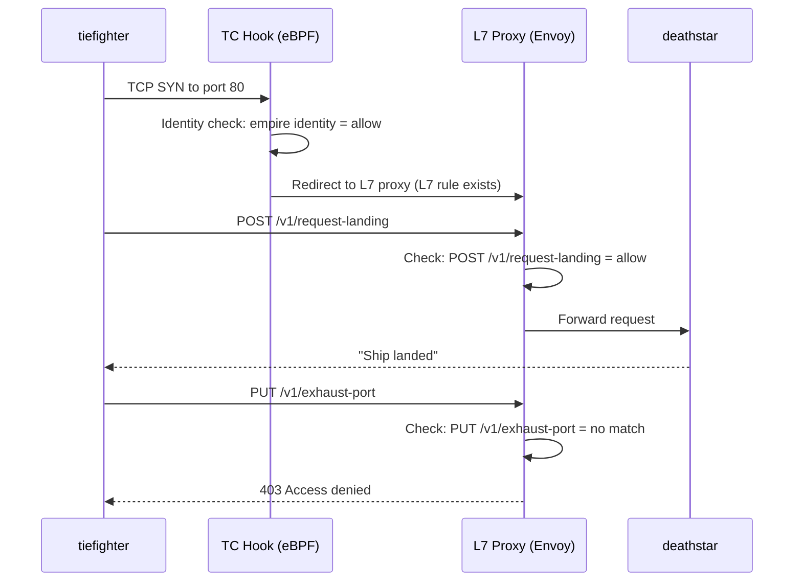

# Understanding the L7 HTTP Policy in the Cilium Star Wars Demo

Author: [nawazdhandala](https://github.com/nawazdhandala)

Tags: Cilium, Kubernetes, eBPF, Network Policy, Star Wars Demo

Description: Understand how Cilium's L7 HTTP-aware policy works in the Star Wars demo and why it is a fundamental advancement over connection-level network policy.

---

## Introduction

The L7 HTTP policy in the Cilium Star Wars demo represents the apex of the demonstration. Having established that L3/L4 policy can block unauthorized connections (no more `xwing` landings), the demo reveals the gap that remains: authorized connections can still access privileged endpoints. The `tiefighter`, cleared to land, can also trigger the Death Star's exhaust port - a catastrophic security failure that no traditional firewall can prevent.

L7 HTTP policy fills this gap. By inspecting the HTTP method and path of requests made by already-authorized connections, Cilium can enforce application-level access control without deploying a sidecar. The `tiefighter` can POST to `/v1/request-landing` but not PUT to `/v1/exhaust-port`. This is precisely the policy that production API services need: not just "who can connect" but "what can they do once connected."

Understanding the L7 policy means understanding both the policy structure (the `rules.http` extension in `CiliumNetworkPolicy`) and the enforcement mechanism (traffic redirection to Cilium's Envoy-based L7 proxy). This dual understanding is essential for using L7 policies effectively in production.

## Prerequisites

- L3/L4 policy stage completed in the Star Wars demo
- Cilium installed with L7 proxy support enabled

## The L7 Policy Resource

```yaml
apiVersion: "cilium.io/v2"
kind: CiliumNetworkPolicy
metadata:
  name: "rule1"
spec:
  description: "L3-L4-L7 policy to restrict deathstar access"
  endpointSelector:
    matchLabels:
      org: empire
      class: deathstar
  ingress:
  - fromEndpoints:
    - matchLabels:
        org: empire
    toPorts:
    - ports:
      - port: "80"
        protocol: TCP
      rules:
        http:                              # L7 HTTP rules section
        - method: "POST"                   # Only allow POST
          path: "/v1/request-landing"      # Only to this path
```

## Traffic Flow with L7 Policy



## Applying and Testing L7 Policy

```bash
# Apply L7 policy
kubectl apply -f https://raw.githubusercontent.com/cilium/cilium/HEAD/examples/minikube/sw_l3_l4_l7_policy.yaml

# Test: allowed endpoint
kubectl exec tiefighter -- curl -s -XPOST deathstar.default.svc.cluster.local/v1/request-landing
# Expected: Ship landed

# Test: blocked endpoint (same pod, same connection, different path)
kubectl exec tiefighter -- curl -s -XPUT deathstar.default.svc.cluster.local/v1/exhaust-port
# Expected: Access denied
```

## L7 Policy Patterns

```yaml
# Multiple allowed paths
rules:
  http:
  - method: "POST"
    path: "/v1/request-landing"
  - method: "GET"
    path: "/v1/health"
  - method: "GET"
    path: "/v1/status/[0-9]+"  # Regex path matching
```

## Conclusion

The L7 HTTP policy in the Cilium Star Wars demo closes the security gap that L3/L4 policy cannot address: application-level path control. By restricting HTTP methods and paths at the proxy level, Cilium provides the granular API access control that production microservices require. The demo's exhaust port scenario - a perfect metaphor for every privileged admin API endpoint in your cluster - shows exactly why this matters. Understanding L7 policy is understanding the complete Cilium security model.
