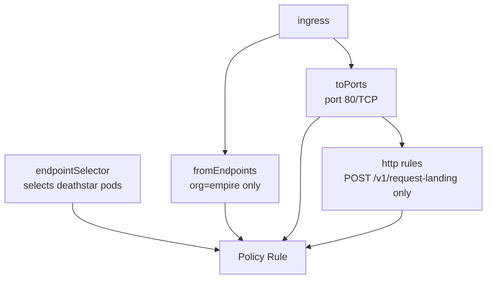

# Understanding the Policy in the Cilium Star Wars Demo

Author: [nawazdhandala](https://github.com/nawazdhandala)

Tags: Cilium, Kubernetes, EBPF, Network Policy, Star Wars Demo

Description: A comprehensive overview of how CiliumNetworkPolicy is structured and how it achieves identity-based L3/L4/L7 enforcement in the Star Wars demo.

---

## Introduction

The policy in the Cilium Star Wars demo is not just a configuration file - it is a concrete expression of the zero-trust networking principle applied to a Kubernetes workload. Understanding the policy means understanding how `CiliumNetworkPolicy` is structured, how the API differs from standard `NetworkPolicy`, and how the combination of `endpointSelector`, `fromEndpoints`, and `toPorts.rules.http` creates a layered security boundary that addresses connection-level and application-level concerns simultaneously.

The Star Wars demo uses two policy files: one for L3/L4 (`sw_l3_l4_policy.yaml`) and one that upgrades to L7 (`sw_l3_l4_l7_policy.yaml`). Both target the same `deathstar` endpoint, but the second adds HTTP method and path awareness. Understanding both is essential for understanding how Cilium's policy language evolves from connection control to application control.

The policy resource is also where Cilium's identity model becomes concrete. The `matchLabels` selectors in the policy are translated into security identity lookups in the eBPF data plane. Every label you put on a pod is a potential selector in a future policy rule - understanding this encourages disciplined label hygiene in production.

## Prerequisites

- Cilium installed on Kubernetes
- Star Wars demo deployed
- `kubectl` access to the cluster

## L3/L4 Policy Structure

```yaml
apiVersion: "cilium.io/v2"
kind: CiliumNetworkPolicy
metadata:
  name: "rule1"
spec:
  description: "L3-L4 policy to restrict deathstar access to empire ships"
  endpointSelector:         # WHICH pods this policy applies TO
    matchLabels:
      org: empire
      class: deathstar
  ingress:                  # INBOUND traffic rules
  - fromEndpoints:          # WHICH sources are allowed
    - matchLabels:
        org: empire
    toPorts:                # WHICH ports are allowed
    - ports:
      - port: "80"
        protocol: TCP
```

## L7 Policy Structure (HTTP-Aware)

```yaml
apiVersion: "cilium.io/v2"
kind: CiliumNetworkPolicy
metadata:
  name: "rule1"
spec:
  endpointSelector:
    matchLabels:
      org: empire
      class: deathstar
  ingress:
  - fromEndpoints:
    - matchLabels:
        org: empire
    toPorts:
    - ports:
      - port: "80"
        protocol: TCP
      rules:              # HTTP-level rules (L7)
        http:
        - method: "POST"
          path: "/v1/request-landing"
```

## Policy Components Diagram



## Applying and Verifying the Policy

```bash
# Apply the L7 policy
kubectl apply -f https://raw.githubusercontent.com/cilium/cilium/HEAD/examples/minikube/sw_l3_l4_l7_policy.yaml

# Describe the policy
kubectl describe CiliumNetworkPolicy rule1

# View in Cilium
kubectl exec -n kube-system ds/cilium -- cilium policy get
```

## Key Policy Concepts

| Concept | Description | Example |
|---------|-------------|---------|
| `endpointSelector` | Which pods the policy applies to | `org=empire, class=deathstar` |
| `fromEndpoints` | Which sources are allowed ingress | `org=empire` |
| `toPorts` | Which ports are accessible | `80/TCP` |
| `rules.http` | Which HTTP methods/paths are allowed | `POST /v1/request-landing` |

## Conclusion

The `CiliumNetworkPolicy` resource in the Star Wars demo is a precise expression of access control that operates at two layers simultaneously: L3/L4 for connection control and L7 for HTTP semantic control. Understanding its structure - the selector hierarchy, the port specification, the HTTP rules extension - gives you the vocabulary to write production policies for your own microservices. Every production service with an API should have a policy that looks very much like this one.
