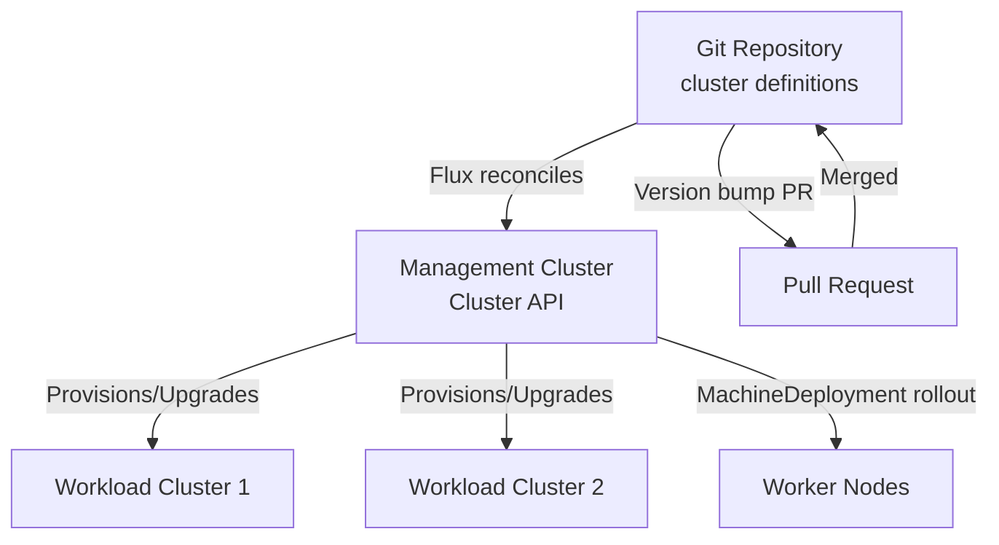

# Upgrade Kubernetes Clusters with Cluster API and Flux

Author: [nawazdhandala](https://github.com/nawazdhandala)

Tags: Flux CD, Cluster API, CAPI, Kubernetes Upgrades, GitOps, Multi-Cluster

Description: Learn how to automate Kubernetes cluster upgrades using Cluster API and Flux CD, enabling GitOps-driven cluster lifecycle management where a version change in Git triggers safe, rolling cluster...

---

## Introduction

Cluster API (CAPI) and Flux CD together create a powerful GitOps platform for Kubernetes cluster lifecycle management. Where Cluster API provides the declarative API for provisioning and upgrading clusters, Flux provides the reconciliation engine that watches Git for changes and applies them to running infrastructure.

When combined, a Kubernetes version change in a Git repository automatically triggers a controlled rolling upgrade of the cluster managed by Cluster API - including control plane rolling updates, machine deployment rollouts, and CNI compatibility verification. This approach eliminates manual kubectl operations for upgrades and creates an auditable, repeatable upgrade process.

This guide demonstrates how to set up and execute Kubernetes cluster upgrades using the Cluster API + Flux combination, including the GitOps workflow for version bumps and the monitoring approach for upgrade progress.

## Prerequisites

- Management cluster with Cluster API operators installed
- Flux v2 installed on the management cluster
- Git repository with cluster definitions
- `clusterctl` CLI installed
- `kubectl` with access to the management cluster
- Target cluster infrastructure provider (AWS, Azure, GCP, or vSphere)

## Architecture Overview



## Step 1: Set Up Flux to Manage Cluster API Clusters

Configure Flux to watch the cluster definition repository.

```yaml
# flux-capi-gitrepository.yaml - Flux GitRepository for cluster definitions
apiVersion: source.toolkit.fluxcd.io/v1
kind: GitRepository
metadata:
  name: cluster-definitions
  namespace: flux-system
spec:
  interval: 1m
  url: https://github.com/your-org/cluster-definitions.git
  ref:
    branch: main
  secretRef:
    name: cluster-definitions-auth
```

```yaml
# flux-capi-kustomization.yaml - Flux Kustomization for workload clusters
apiVersion: kustomize.toolkit.fluxcd.io/v1
kind: Kustomization
metadata:
  name: workload-clusters
  namespace: flux-system
spec:
  interval: 5m
  path: "./clusters/production"
  prune: true
  sourceRef:
    kind: GitRepository
    name: cluster-definitions
  # Wait for health checks before proceeding
  healthChecks:
  - apiVersion: cluster.x-k8s.io/v1beta1
    kind: Cluster
    name: production-cluster
    namespace: capi-clusters
```

## Step 2: Define Cluster API Cluster with Version Pinning

Create a cluster definition with explicit Kubernetes version.

```yaml
# clusters/production/cluster.yaml - CAPI cluster with pinned version
apiVersion: cluster.x-k8s.io/v1beta1
kind: Cluster
metadata:
  name: production-cluster
  namespace: capi-clusters
spec:
  clusterNetwork:
    pods:
      cidrBlocks: ["10.244.0.0/16"]
    services:
      cidrBlocks: ["10.96.0.0/12"]
  controlPlaneRef:
    apiVersion: controlplane.cluster.x-k8s.io/v1beta1
    kind: KubeadmControlPlane
    name: production-control-plane
  infrastructureRef:
    apiVersion: infrastructure.cluster.x-k8s.io/v1beta2
    kind: AWSCluster
    name: production-aws-cluster
---
apiVersion: controlplane.cluster.x-k8s.io/v1beta1
kind: KubeadmControlPlane
metadata:
  name: production-control-plane
  namespace: capi-clusters
spec:
  replicas: 3
  # Pin Kubernetes version - changing this in Git triggers upgrade
  version: v1.29.0
  machineTemplate:
    infrastructureRef:
      apiVersion: infrastructure.cluster.x-k8s.io/v1beta2
      kind: AWSMachineTemplate
      name: production-control-plane-template
```

## Step 3: Trigger a Cluster Upgrade via Git

Initiate a Kubernetes version upgrade by updating the version in Git.

```bash
# Create a branch for the upgrade
git checkout -b upgrade/k8s-1-30-0

# Edit the cluster version in the definition
# Change: version: v1.29.0
# To:     version: v1.30.0
sed -i 's/version: v1.29.0/version: v1.30.0/' clusters/production/cluster.yaml

# Also update MachineDeployment version for worker nodes
sed -i 's/version: v1.29.0/version: v1.30.0/' clusters/production/machinedeployment.yaml

# Commit and push the version bump
git add clusters/production/
git commit -m "upgrade: Kubernetes v1.29.0 -> v1.30.0 for production cluster"
git push origin upgrade/k8s-1-30-0

# Create and merge PR after review
# Flux will detect the change and reconcile within the poll interval
```

## Step 4: Monitor the Flux-Triggered Upgrade

Watch Flux reconcile the version bump and CAPI execute the upgrade.

```bash
# Watch Flux reconciliation status
flux get kustomizations workload-clusters --watch

# Monitor CAPI cluster upgrade progress
kubectl get clusters -n capi-clusters -w

# Watch control plane upgrade
kubectl get kubeadmcontrolplane -n capi-clusters -w

# Watch machine deployment rollout (worker nodes)
kubectl get machinedeployments -n capi-clusters -w

# Check individual machine status
kubectl get machines -n capi-clusters -o wide
```

## Step 5: Validate the Upgraded Cluster

Verify the cluster upgrade completed successfully.

```bash
# Get kubeconfig for the upgraded cluster
clusterctl get kubeconfig production-cluster -n capi-clusters > production-kubeconfig.yaml

# Check Kubernetes version on all nodes
kubectl --kubeconfig production-kubeconfig.yaml get nodes -o wide

# Verify all cluster add-ons are healthy (Cilium, CoreDNS, etc.)
kubectl --kubeconfig production-kubeconfig.yaml get pods -A | grep -v Running | grep -v Completed

# Run a basic workload test
kubectl --kubeconfig production-kubeconfig.yaml run upgrade-test \
  --image=nginx --rm -it --restart=Never -- nginx -v
```

## Best Practices

- Require PR reviews for all Kubernetes version bumps in the cluster definitions repository
- Use Flux's `healthChecks` to wait for cluster health before reconciling dependent resources
- Upgrade clusters one environment at a time: dev, then staging, then production
- Pin both Kubernetes version and infrastructure provider machine image versions in Git
- Set up Flux notifications to Slack/Teams when cluster upgrades start and complete

## Conclusion

Combining Cluster API and Flux CD creates a GitOps-native cluster upgrade workflow where version changes in Git automatically trigger controlled, rolling Kubernetes upgrades. This approach provides auditability, repeatability, and rollback capability through Git history - all without manual kubectl operations. The key operational insight is that cluster upgrades become a pull request merge rather than an operational procedure, integrating cluster lifecycle management into standard software delivery workflows.
