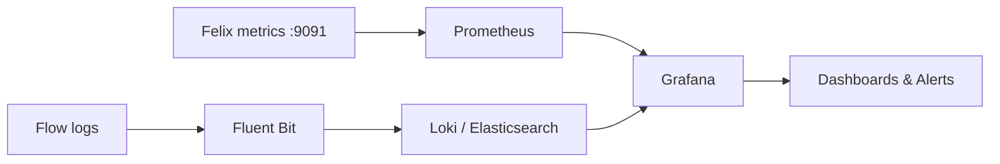

# Calico Observability: use-bgp-health-monitoring-calico

Author: [nawazdhandala](https://github.com/nawazdhandala)

Tags: Calico, Kubernetes, Networking, Observability

Description: Configure Calico observability capabilities for network visibility, security monitoring, and operational awareness.

---

## Introduction

Calico provides multiple observability mechanisms: Felix Prometheus metrics (port 9091), flow logs for connection-level visibility, and integration with Grafana for dashboards. This guide covers how to configure and use these capabilities effectively.

## Key Commands

```bash
# Enable Felix metrics
kubectl patch felixconfiguration default \
  --type=merge \
  -p '{"spec":{"prometheusMetricsEnabled":true,"prometheusMetricsPort":9091}}'

# Enable flow logs
kubectl patch felixconfiguration default \
  --type=merge \
  -p '{"spec":{"flowLogsFlushInterval":"15s","flowLogsFileEnabled":true}}'

# Check BGP peer state
calicoctl node status

# View metrics
CALICO_POD=$(kubectl get pods -n calico-system -l app=calico-node \
  -o jsonpath='{.items[0].metadata.name}')
kubectl exec -n calico-system "${CALICO_POD}" -c calico-node -- \
  wget -qO- http://localhost:9091/metrics | grep felix | head -20
```

## Observability Architecture



## Alert Configuration

```yaml
apiVersion: monitoring.coreos.com/v1
kind: PrometheusRule
metadata:
  name: calico-observability-alerts
  namespace: calico-system
spec:
  groups:
    - name: calico.network
      rules:
        - alert: CalicoHighDenyRate
          expr: rate(felix_calc_graph_output_events{type="PolicyDrop"}[5m]) > 10
          for: 5m
          annotations:
            summary: "High Calico policy deny rate on {{ $labels.instance }}"
        - alert: CalicoFelixMetricsDown
          expr: up{job="calico-node-metrics"} == 0
          for: 5m
          annotations:
            summary: "Calico Felix metrics unreachable on {{ $labels.instance }}"
```

## Conclusion

Calico observability requires enabling Felix Prometheus metrics, configuring flow logs for connection-level data, and building dashboards that surface actionable signals. The three most important operational signals are Felix dataplane failures (indicates iptables programming errors), high policy deny rate (indicates policy misconfiguration or security events), and IPAM utilization (indicates capacity issues). Configure alerts for all three from day one in production clusters.
