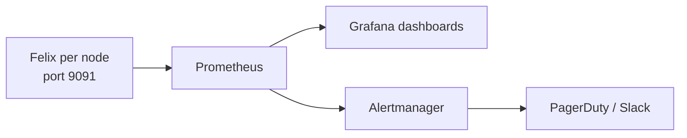

# How to Use the Calico Flow Logs API

Author: [nawazdhandala](https://github.com/nawazdhandala)

Tags: Calico, Kubernetes, Networking, Observability

Description: Query the Calico Flow Logs API to retrieve network connection records for specific pods, namespaces, or time windows for security investigation and compliance reporting.

---

## Introduction

The Calico Flow Logs API enables programmatic queries against historical flow data. Key use cases include SIEM integration (pull deny events for security monitoring), compliance reporting (audit all connections to a regulated service over 90 days), and capacity planning (analyze bandwidth consumption by namespace over the past month).

## Key Commands

```bash
# Enable Felix metrics (if not already enabled)
kubectl patch felixconfiguration default   --type=merge   -p '{"spec":{"prometheusMetricsEnabled":true,"prometheusMetricsPort":9091}}'

# Test Felix metrics endpoint
CALICO_POD=$(kubectl get pods -n calico-system -l k8s-app=calico-node   -o jsonpath='{.items[0].metadata.name}')

kubectl exec -n calico-system "${CALICO_POD}" -c calico-node --   wget -qO- http://localhost:9091/metrics | head -30

# Key Felix metrics to check:
kubectl exec -n calico-system "${CALICO_POD}" -c calico-node --   wget -qO- http://localhost:9091/metrics | grep -E   "^felix_int_dataplane_failures|^felix_calc_graph"
```

## ServiceMonitor for Felix

```yaml
apiVersion: monitoring.coreos.com/v1
kind: ServiceMonitor
metadata:
  name: calico-felix-metrics
  namespace: calico-system
spec:
  selector:
    matchLabels:
      k8s-app: calico-node
  endpoints:
    - port: http-metrics
      path: /metrics
      interval: 30s
```

## Architecture



## Conclusion

Felix metrics provide the deepest operational visibility into the Calico data plane. Enable the Prometheus endpoint via FelixConfiguration, configure a ServiceMonitor to scrape all calico-node pods, and build dashboards focused on dataplane failures and policy calculation latency. These two metric categories detect the most impactful Calico failure modes before they cause visible pod connectivity issues.
