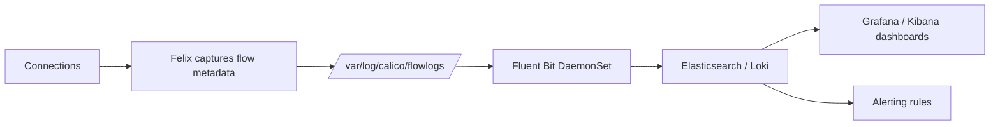

# How to Use Calico Flow Logs

Author: [nawazdhandala](https://github.com/nawazdhandala)

Tags: Calico, Kubernetes, Networking, Observability

Description: Use Calico flow logs to investigate network connectivity issues, audit policy enforcement decisions, and understand bandwidth consumption patterns across your Kubernetes cluster.

---

## Introduction

Calico flow logs provide aggregated connection metadata for network security auditing and troubleshooting. In Calico Cloud and Calico Enterprise file-based flow logs, each entry can include source and destination endpoint information, namespaces, bytes and packets transferred, and the policy decision. When policy information is included in the flow log configuration, this data helps answer questions about what traffic patterns occurred, how much data was transferred, and which policy rule allowed or denied a flow.

## Key Commands

```bash
# View file-based flow logs directly from a calico-node pod

CALICO_POD=$(kubectl get pods -n calico-system -l k8s-app=calico-node   -o jsonpath='{.items[0].metadata.name}')

kubectl exec -n calico-system "${CALICO_POD}" -c calico-node --   tail -20 /var/log/calico/flowlogs/flows.log 2>/dev/null

# Filter for denied flows
kubectl exec -n calico-system "${CALICO_POD}" -c calico-node --   awk '$NF == "deny"' /var/log/calico/flowlogs/flows.log | tail -10

# Check file-based flow log configuration
kubectl get felixconfiguration default -o yaml |   grep -i "flowLogsFile"
```

## Flow Log Format

```plaintext
# Example flow log entry (abbreviated):
# startTime endTime srcType srcNamespace srcName srcLabels dstType dstNamespace dstName
# dstLabels srcIP dstIP proto srcPort dstPort numFlows numFlowsStarted numFlowsCompleted
# reporter packetsIn packetsOut bytesIn bytesOut action

# Allowed flow example:
# 1773396000 1773396300 wep default frontend-abc* - wep production backend* - 192.168.1.5 192.168.2.10 tcp 54321 8080 1 1 0 src 0 12 0 1500 allow

# Denied flow example:
# 1773396005 1773396305 wep default frontend-abc* - wep database postgres* - 192.168.1.5 192.168.3.1 tcp 54322 5432 1 1 0 src 0 1 0 60 deny
```

## Architecture



## Conclusion

Calico flow logs provide aggregated connection-level detail for network visibility and policy troubleshooting. The most valuable operational use case is denied traffic analysis - flow logs show which traffic patterns are being blocked, and with policy fields enabled they can show which policy rule caused the decision. Validate the flow log pipeline periodically by generating known test connections and verifying they appear with the correct attributes in your aggregation system.
