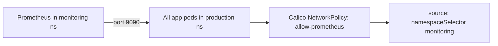

# Use Calico NetworkPolicy Resource

Author: [nawazdhandala](https://github.com/nawazdhandala)

Tags: Calico, Kubernetes, Networking, NetworkPolicy, Security, Best Practices

Description: Practical usage patterns and best practices for Calico NetworkPolicy resources, including common security scenarios, microsegmentation patterns, and multi-tier policy design.

---

## Introduction

The Calico NetworkPolicy resource is the primary tool for implementing zero-trust networking within a Kubernetes namespace. Effective use goes beyond simple allow/deny rules to implement security patterns like default deny, tiered policies for different security levels, and microsegmentation that isolates application tiers within a namespace.

This guide covers practical usage patterns and common security scenarios implemented with Calico NetworkPolicy resources.

## Prerequisites

- Calico installed with network policy enforcement
- `calicoctl` and `kubectl` access
- Test application with multiple tiers (frontend, backend, database)

## Usage Pattern 1: Three-Tier Application Isolation

Implement strict communication boundaries for a frontend/backend/database architecture:

```yaml
# Allow ingress to frontend from internet (via ingress controller)
apiVersion: projectcalico.org/v3
kind: NetworkPolicy
metadata:
  name: allow-frontend-ingress
  namespace: production
spec:
  selector: "app == 'frontend'"
  order: 100
  ingress:
    - action: Allow
      source:
        selector: "app == 'ingress-nginx'"
      destination:
        ports: [80]
---
# Allow frontend to backend communication only
apiVersion: projectcalico.org/v3
kind: NetworkPolicy
metadata:
  name: allow-backend-from-frontend
  namespace: production
spec:
  selector: "app == 'backend'"
  order: 100
  ingress:
    - action: Allow
      source:
        selector: "app == 'frontend'"
      destination:
        ports: [8080]
---
# Allow backend to database only
apiVersion: projectcalico.org/v3
kind: NetworkPolicy
metadata:
  name: allow-db-from-backend
  namespace: production
spec:
  selector: "app == 'database'"
  order: 100
  ingress:
    - action: Allow
      source:
        selector: "app == 'backend'"
      destination:
        ports: [5432]
```

## Usage Pattern 2: Allow Monitoring Access



```yaml
apiVersion: projectcalico.org/v3
kind: NetworkPolicy
metadata:
  name: allow-prometheus-scrape
  namespace: production
spec:
  selector: "all()"
  order: 50
  ingress:
    - action: Allow
      source:
        namespaceSelector: "kubernetes.io/metadata.name == 'monitoring'"
      destination:
        ports: [9090, 9091, 8080]
```

## Usage Pattern 3: Allow DNS Egress

All pods need DNS. Always include this in egress policies:

```yaml
apiVersion: projectcalico.org/v3
kind: NetworkPolicy
metadata:
  name: allow-dns-egress
  namespace: production
spec:
  selector: "all()"
  order: 10
  egress:
    - action: Allow
      protocol: UDP
      destination:
        namespaceSelector: "kubernetes.io/metadata.name == 'kube-system'"
        selector: "k8s-app == 'kube-dns'"
        ports: [53]
    - action: Allow
      protocol: TCP
      destination:
        namespaceSelector: "kubernetes.io/metadata.name == 'kube-system'"
        selector: "k8s-app == 'kube-dns'"
        ports: [53]
```

## Usage Pattern 4: Egress to External Services

```yaml
apiVersion: projectcalico.org/v3
kind: NetworkPolicy
metadata:
  name: allow-external-api-egress
  namespace: production
spec:
  selector: "app == 'backend'"
  order: 200
  egress:
    - action: Allow
      destination:
        nets:
          - 52.94.76.0/22   # AWS API Gateway CIDRs
        ports: [443]
      protocol: TCP
```

## Usage Pattern 5: Namespace Isolation with Exceptions

```yaml
# Block all cross-namespace traffic
apiVersion: projectcalico.org/v3
kind: NetworkPolicy
metadata:
  name: deny-from-other-namespaces
  namespace: production
spec:
  selector: "all()"
  order: 900
  ingress:
    - action: Allow
      source:
        namespaceSelector: "kubernetes.io/metadata.name == 'production'"
    - action: Deny
```

## Conclusion

Effective use of Calico NetworkPolicy resources follows a consistent pattern: namespace-level default deny with explicit allow rules for each communication path, a shared DNS egress policy, monitoring access allows, and external service allowlists. The three-tier isolation pattern is a reusable template that can be adapted for most application architectures. Label conventions should be standardized across the cluster to make policies readable and maintainable.
