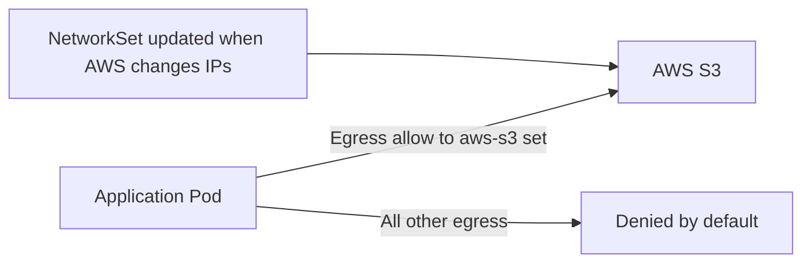

# Use Calico NetworkSet Resource

Author: [nawazdhandala](https://github.com/nawazdhandala)

Tags: Calico, Kubernetes, Networking, NetworkSet, Security, Best Practices

Description: Practical usage patterns for Calico NetworkSet resources, including allowlists for external services, blocklists for threat intelligence feeds, and geographic IP restrictions.

---

## Introduction

Calico NetworkSet resources shine in scenarios where policies need to reference groups of external IP addresses that change over time. By decoupling IP lists from policy definitions, NetworkSets enable operational workflows where IP lists (threat intelligence, partner CIDRs, cloud provider ranges) can be updated without modifying policies.

This guide covers practical usage patterns that demonstrate the power and flexibility of Calico NetworkSet resources.

## Usage Pattern 1: Threat Intelligence Blocklist

Integrate with threat intelligence feeds to automatically block known malicious IPs:

```yaml
apiVersion: projectcalico.org/v3
kind: GlobalNetworkSet
metadata:
  name: threat-intel-blocklist
  labels:
    type: threat-intel
    action: block
spec:
  nets:
    - 185.220.100.0/22  # Known Tor exit nodes
    - 198.199.0.0/16    # Known scanner ranges
    # Updated daily by automation pipeline
```

Policy:

```yaml
apiVersion: projectcalico.org/v3
kind: GlobalNetworkPolicy
metadata:
  name: block-threat-intel
spec:
  selector: "all()"
  order: 1
  ingress:
    - action: Deny
      source:
        selector: "type == 'threat-intel' && action == 'block'"
  egress:
    - action: Deny
      destination:
        selector: "type == 'threat-intel' && action == 'block'"
```

Update automation:

```bash
#!/bin/bash
# update-threat-blocklist.sh - Run daily via CronJob
FEED_URL="https://threat-intel.example.com/iplist.txt"

# Download current threat feed
NEW_IPS=$(curl -sf "$FEED_URL" | grep -E "^[0-9]" | sed 's/$/\/32/' | head -500)

# Update NetworkSet
calicoctl patch globalnetworkset threat-intel-blocklist \
  --patch="{\"spec\":{\"nets\":[$(echo "$NEW_IPS" | python3 -c 'import sys; ips=sys.stdin.read().split(); print(",".join(f"\"{ip}\"" for ip in ips))' )]}}"
```

## Usage Pattern 2: Cloud Provider IP Ranges

Allow access to specific cloud services only:

```yaml
apiVersion: projectcalico.org/v3
kind: GlobalNetworkSet
metadata:
  name: aws-s3-us-east
  labels:
    service: s3
    cloud: aws
    region: us-east
spec:
  nets:
    - 52.216.0.0/15
    - 52.92.16.0/20
    - 54.231.0.0/17
```



## Usage Pattern 3: Geographic IP Restriction

```yaml
apiVersion: projectcalico.org/v3
kind: NetworkSet
metadata:
  name: allowed-countries
  namespace: restricted-app
  labels:
    geo: allowed
spec:
  nets:
    # United States major blocks (simplified)
    - 3.0.0.0/8
    - 4.0.0.0/8
    # UK
    - 51.0.0.0/8
    - 81.128.0.0/11
```

## Usage Pattern 4: Partner API Allowlist

```yaml
apiVersion: projectcalico.org/v3
kind: NetworkSet
metadata:
  name: partner-apis
  namespace: integrations
  labels:
    type: partner
    trust: external-trusted
spec:
  nets:
    - 203.0.113.0/24   # Partner A
    - 198.51.100.0/28  # Partner B
```

Add new partners by updating the NetworkSet - no policy changes needed:

```bash
calicoctl get networkset partner-apis -n integrations -o yaml > partner-apis.yaml
# Add new partner CIDR to nets list
calicoctl apply -f partner-apis.yaml
```

## Usage Pattern 5: Development vs Production IP Lists

Use different NetworkSets per environment with the same labels:

```yaml
# Production
apiVersion: projectcalico.org/v3
kind: NetworkSet
metadata:
  name: allowed-clients
  namespace: production
  labels:
    role: allowed-clients
spec:
  nets:
    - 10.0.0.0/8        # Corporate network

---
# Development (more permissive)
apiVersion: projectcalico.org/v3
kind: NetworkSet
metadata:
  name: allowed-clients
  namespace: development
  labels:
    role: allowed-clients
spec:
  nets:
    - 0.0.0.0/0          # Any IP for development
```

## Conclusion

Calico NetworkSet resources are most valuable for IP lists that change over time - threat intelligence feeds, cloud provider CIDRs, partner IP ranges, and geographic allowlists. By separating IP list management from policy definition, NetworkSets enable automation pipelines to keep IP lists current without requiring policy modifications. This decoupling is a key operational advantage for maintaining up-to-date network security posture.
