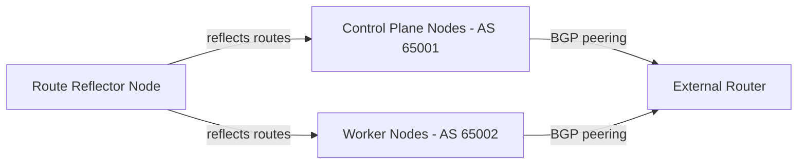

# Use Calico Node Resource

Author: [nawazdhandala](https://github.com/nawazdhandala)

Tags: Calico, Kubernetes, Networking, Node, BGP, Operations

Description: Practical usage patterns for Calico Node resources, including per-node BGP AS number assignments, multi-homed node configuration, inspecting node state, and using Node resources in operational...

---

## Introduction

The Calico Node resource is primarily used in two operational contexts: initial configuration where per-node BGP settings need to differ from cluster defaults, and ongoing operations where Node resources provide visibility into each node's network identity. Reading Node resources surfaces the actual BGP configuration in use - the IP addresses, AS numbers, and tunnel endpoints - which is essential for debugging routing issues and planning topology changes.

This guide covers practical patterns for using the Node resource in real cluster operations.

## Usage Pattern 1: Inspect BGP Topology

Get a quick overview of BGP configuration across all nodes:

```bash
# Show all nodes with their BGP addresses and AS numbers
calicoctl get nodes -o json | python3 -c "
import json, sys
data = json.load(sys.stdin)
print(f'{'Node':<30} {'IPv4':<20} {'AS':<10} {'Tunnel IP':<15}')
print('-' * 75)
for n in data['items']:
    name = n['metadata']['name']
    bgp = n['spec'].get('bgp', {})
    ipv4 = bgp.get('ipv4Address', '-')
    asn = str(bgp.get('asNumber', 'global'))
    tunnel = n['spec'].get('ipv4VXLANTunnelAddr', '-')
    print(f'{name:<30} {ipv4:<20} {asn:<10} {tunnel:<15}')
"
```

## Usage Pattern 2: Assign Different AS Numbers to Node Groups

For route reflector topologies or multi-region clusters, assign AS numbers by node role:

```bash
# Assign AS 65001 to control plane nodes
for node in $(kubectl get nodes -l node-role.kubernetes.io/control-plane -o name | sed 's|node/||'); do
  calicoctl patch node $node \
    --patch='{"spec":{"bgp":{"asNumber": 65001}}}'
done

# Assign AS 65002 to worker nodes
for node in $(kubectl get nodes -l node-role.kubernetes.io/worker -o name | sed 's|node/||'); do
  calicoctl patch node $node \
    --patch='{"spec":{"bgp":{"asNumber": 65002}}}'
done
```



## Usage Pattern 3: Configure Multi-Homed Nodes

For nodes with multiple network interfaces, specify which IP to use for BGP and tunneling:

```yaml
apiVersion: projectcalico.org/v3
kind: Node
metadata:
  name: worker-multinic-1
spec:
  bgp:
    ipv4Address: 10.0.1.15/24    # Use storage network interface for BGP
  ipv4VXLANTunnelAddr: 10.0.1.15
```

## Usage Pattern 4: Export Node State for Capacity Planning

```bash
# Export all node BGP state for documentation or capacity planning
calicoctl get nodes -o yaml > cluster-node-state-$(date +%Y%m%d).yaml

# Generate summary for capacity planning
calicoctl get nodes -o json | python3 -c "
import json, sys
data = json.load(sys.stdin)
as_groups = {}
for n in data['items']:
    asn = str(n['spec'].get('bgp', {}).get('asNumber', 'global'))
    as_groups.setdefault(asn, []).append(n['metadata']['name'])

for asn, nodes in sorted(as_groups.items()):
    print(f'AS {asn}: {len(nodes)} nodes')
"
```

## Usage Pattern 5: Reset a Node for Re-provisioning

When replacing a node, delete its Calico Node resource to clean up BGP state:

```bash
# Drain and delete the Kubernetes node
kubectl drain old-worker-1 --ignore-daemonsets --delete-emptydir-data
kubectl delete node old-worker-1

# Clean up the Calico Node resource
calicoctl delete node old-worker-1

# Verify cleanup
calicoctl get nodes | grep old-worker-1  # Should return nothing
```

## Conclusion

The Calico Node resource is both a configuration surface and an operational visibility tool. The most common operational uses are inspecting BGP topology across the cluster, assigning per-node AS numbers for advanced routing designs, and cleaning up stale Node resources when decommissioning nodes. Unlike most Calico resources, Node resources are tightly coupled to the underlying Kubernetes node lifecycle and should be managed alongside node provisioning and decommissioning workflows.
