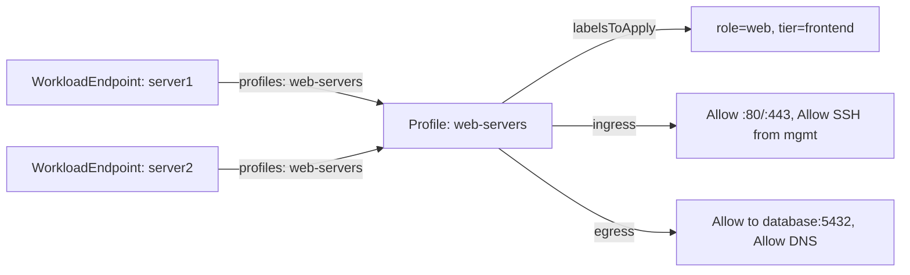

# Use Calico Profile Resource

Author: [nawazdhandala](https://github.com/nawazdhandala)

Tags: Calico, Kubernetes, Networking, Profiles, Security, Operations

Description: Practical usage patterns for Calico Profile resources, including namespace policy inheritance, reusable policy sets for non-Kubernetes workloads, and using profiles to apply baseline security...

---

## Introduction

Calico Profile resources are most powerful in two scenarios: as a mechanism for namespace-level label inheritance in Kubernetes (enabling namespace-scoped policy selectors), and as reusable policy templates for non-Kubernetes workloads where the same security rules apply to multiple endpoints. In Kubernetes, profiles operate mostly invisibly - but understanding their patterns enables advanced policy designs like default egress policies applied at the namespace level rather than per-workload.

## Usage Pattern 1: Inspect Namespace Label Inheritance

Understand how namespace labels flow to workload endpoints via profiles:

```bash
# See which labels a namespace profile applies
calicoctl get profile kns.production -o json | python3 -c "
import json, sys
p = json.load(sys.stdin)
labels = p['spec'].get('labelsToApply', {})
print(f'Profile kns.production applies {len(labels)} labels:')
for k, v in labels.items():
    print(f'  {k} = {v}')
"

# Verify an endpoint has those labels
calicoctl get workloadendpoint -n production -o json | python3 -c "
import json, sys
data = json.load(sys.stdin)
ep = data['items'][0]
print('Endpoint labels:')
for k, v in ep['metadata'].get('labels', {}).items():
    print(f'  {k} = {v}')
"
```

## Usage Pattern 2: Namespace-Level Default Egress via Profile

In Kubernetes, add a default egress allow to a namespace profile for all pods in that namespace:

```bash
# Add default allow-all egress to the production namespace profile
# WARNING: Only do this if you have specific ingress restrictions via NetworkPolicy
calicoctl patch profile kns.production --patch='{
  "spec": {
    "egress": [
      {"action": "Allow"}
    ]
  }
}'
```

Note: This is useful when migrating to a default-deny model incrementally - allow egress at the namespace profile level while implementing ingress restrictions via NetworkPolicy first.

## Usage Pattern 3: Reusable Profile for Non-Kubernetes Workloads

```yaml
apiVersion: projectcalico.org/v3
kind: Profile
metadata:
  name: web-servers
spec:
  labelsToApply:
    role: web
    tier: frontend
  ingress:
    - action: Allow
      destination:
        ports: [80, 443]
    - action: Allow
      source:
        nets: [10.0.0.0/8]  # Management network
        ports: [22]
    - action: Deny
  egress:
    - action: Allow
      destination:
        selector: "role == 'database'"
        ports: [5432]
    - action: Allow
      destination:
        ports: [53]
    - action: Deny
```



## Usage Pattern 4: Apply Profile to New WorkloadEndpoint

```bash
# When adding a new bare-metal server to Calico management
calicoctl apply -f - <<EOF
apiVersion: projectcalico.org/v3
kind: WorkloadEndpoint
metadata:
  name: new-web-server-eth0
  namespace: default
spec:
  node: bare-metal-host-1
  orchestrator: bare
  endpoint: eth0
  profiles:
    - web-servers
  ipNetworks:
    - 203.0.113.50/32
EOF
```

## Usage Pattern 5: List Workloads by Profile

```bash
# Find all workload endpoints using a specific profile
calicoctl get workloadendpoints -A -o json | python3 -c "
import json, sys
data = json.load(sys.stdin)
profile_name = 'web-servers'
for ep in data['items']:
    if profile_name in ep['spec'].get('profiles', []):
        print(f'{ep[\"metadata\"][\"namespace\"]}/{ep[\"metadata\"][\"name\"]}')
"
```

## Conclusion

Profiles provide policy inheritance that NetworkPolicies alone cannot - they attach labels and rules directly to endpoints regardless of how those endpoints are selected. For Kubernetes workloads, the primary value is namespace label propagation enabling `namespaceSelector` in cross-namespace policies. For non-Kubernetes workloads, profiles are the primary mechanism for applying consistent security baselines across groups of servers with identical security requirements.
