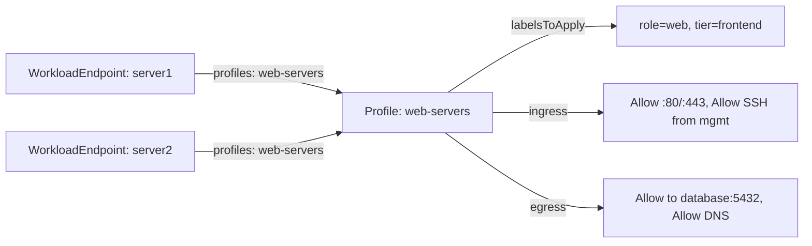

# Use Calico Profile Resource

Author: [nawazdhandala](https://github.com/nawazdhandala)

Tags: Calico, Kubernetes, Networking, Profiles, Security, Operation

Description: Practical usage patterns for Calico Profile resources, including namespace policy inheritance, reusable policy sets for non-Kubernetes workloads, and using profiles to apply baseline security...

---

## Introduction

Calico Profile resources are most useful as a mechanism for shared endpoint labels, including namespace-level label inheritance in Kubernetes (enabling namespace-scoped policy selectors). Profiles can also contain policy rules for endpoints that reference them, but Profile `ingress` and `egress` rules are deprecated in favor of NetworkPolicy and GlobalNetworkPolicy. In Kubernetes, profiles operate mostly invisibly - but understanding their patterns helps you recognize how namespace labels are made available to policy selectors.

## Usage Pattern 1: Inspect Namespace Label Inheritance

Understand how namespace labels flow to workload endpoints via profiles:

```bash
# See which labels a namespace profile applies

calicoctl get profile kns.production -o json | python3 -c "
import json, sys
p = json.load(sys.stdin)
labels = p['spec'].get('labelsToApply', {})
print(f'Profile kns.production applies {len(labels)} labels:')
for k, v in labels.items():
    print(f'  {k} = {v}')
"

# Verify an endpoint is assigned the namespace profile
calicoctl get workloadendpoint -n production -o json | python3 -c "
import json, sys
data = json.load(sys.stdin)
ep = data['items'][0]
print('Endpoint profiles:')
for profile in ep['spec'].get('profiles', []):
    print(f'  {profile}')
"
```

## Usage Pattern 2: Legacy Namespace-Level Default Egress via Profile

In Kubernetes, existing clusters may use a namespace profile to add a default egress allow for all pods in that namespace. Profile rules are deprecated, so prefer NetworkPolicy or GlobalNetworkPolicy for new policy design:

```bash
# Add default allow-all egress to the production namespace profile
# WARNING: Only do this if you have specific ingress restrictions via NetworkPolicy
calicoctl patch profile kns.production --patch='{
  "spec": {
    "egress": [
      {"action": "Allow"}
    ]
  }
}'
```

Note: This can be useful when maintaining older deployments during a migration to a default-deny model, but new policy should use NetworkPolicy or GlobalNetworkPolicy instead.

## Usage Pattern 3: Legacy Reusable Profile for Non-Kubernetes Workloads

```yaml
apiVersion: projectcalico.org/v3
kind: Profile
metadata:
  name: web-servers
spec:
  labelsToApply:
    role: web
    tier: frontend
  ingress:
    - action: Allow
      protocol: TCP
      destination:
        ports: [80, 443]
    - action: Allow
      protocol: TCP
      source:
        nets: [10.0.0.0/8]  # Management network
      destination:
        ports: [22]
    - action: Deny
  egress:
    - action: Allow
      protocol: TCP
      destination:
        selector: "role == 'database'"
        ports: [5432]
    - action: Allow
      protocol: UDP
      destination:
        ports: [53]
    - action: Allow
      protocol: TCP
      destination:
        ports: [53]
    - action: Deny
```


```mermaid
graph LR
    A[Profile: web-servers] -->|labelsToApply| B[role=web, tier=frontend]
    A -->|ingress| C[Allow :80/:443, Allow SSH from mgmt]
    A -->|egress| D[Allow to database:5432, Allow DNS]
    E[WorkloadEndpoint: server1] -->|profiles: web-servers| A
    F[WorkloadEndpoint: server2] -->|profiles: web-servers| A
```

## Usage Pattern 4: Apply Profile to New WorkloadEndpoint

```bash
# When adding a new VM workload endpoint to Calico management
calicoctl apply -f - <<EOF
apiVersion: projectcalico.org/v3
kind: WorkloadEndpoint
metadata:
  name: new-web-server-eth0
  namespace: default
spec:
  node: vm-host-1
  orchestrator: bare
  endpoint: eth0
  interfaceName: tap-web-server
  profiles:
    - web-servers
  ipNetworks:
    - 203.0.113.50/32
EOF
```

## Usage Pattern 5: List Workloads by Profile

```bash
# Find all workload endpoints using a specific profile
calicoctl get workloadendpoints -A -o json | python3 -c "
import json, sys
data = json.load(sys.stdin)
profile_name = 'web-servers'
for ep in data['items']:
    if profile_name in ep['spec'].get('profiles', []):
        print(f'{ep[\"metadata\"][\"namespace\"]}/{ep[\"metadata\"][\"name\"]}')
"
```

## Conclusion

Profiles provide label inheritance that NetworkPolicies alone cannot - they attach labels directly to endpoints regardless of how those endpoints are selected. For Kubernetes workloads, the primary value is namespace label propagation enabling `namespaceSelector` in cross-namespace policies. For non-Kubernetes workloads, profiles can group endpoints under shared labels and legacy rules, but Profile policy rules are deprecated in favor of NetworkPolicy and GlobalNetworkPolicy.
