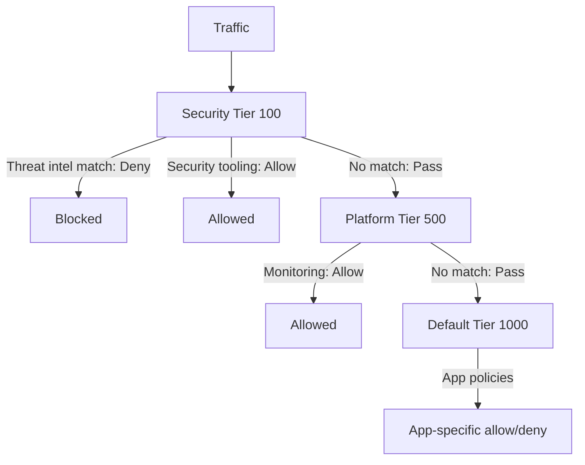

# Use Calico Tier Resource

Author: [nawazdhandala](https://github.com/nawazdhandala)

Tags: Calico, Kubernetes, Networking, Tier, Policy, Operations

Description: Practical usage patterns for Calico Tier resources, including multi-team policy governance models, security baseline enforcement, compliance policy tiers, and combining tiers with RBAC for policy...

---

## Introduction

Calico Tier resources enable policy governance at scale - separating who can define what policies at which priority. The key operational pattern is a three-tier model: a security team owns the high-priority tier for non-negotiable security baselines, a platform team owns a mid-priority tier for infrastructure connectivity, and application teams own the default tier for their service-to-service policies. This separation ensures that application teams cannot accidentally or intentionally bypass security baselines.

## Usage Pattern 1: Three-Tier Policy Governance Model

```yaml
# Security tier - owned by security team
apiVersion: projectcalico.org/v3
kind: Tier
metadata:
  name: security
spec:
  order: 100
---
# Platform tier - owned by platform/SRE team
apiVersion: projectcalico.org/v3
kind: Tier
metadata:
  name: platform
spec:
  order: 500
# default tier already exists at order 1000
```

```bash
calicoctl apply -f tiers.yaml
```

## Usage Pattern 2: Security Baseline Policy in Security Tier

```yaml
# Block traffic to/from known threat sources - cannot be bypassed by app policies
apiVersion: projectcalico.org/v3
kind: GlobalNetworkPolicy
metadata:
  name: security.block-threat-intel
spec:
  tier: security
  order: 100
  selector: "all()"
  ingress:
    - action: Deny
      source:
        selector: "type == 'threat-intel'"
  egress:
    - action: Deny
      destination:
        selector: "type == 'threat-intel'"
---
# Allow management access for security team - high priority
apiVersion: projectcalico.org/v3
kind: GlobalNetworkPolicy
metadata:
  name: security.allow-security-tooling
spec:
  tier: security
  order: 200
  selector: "all()"
  ingress:
    - action: Allow
      source:
        selector: "app == 'security-scanner'"
  egress:
    - action: Pass  # Let lower tiers handle other egress
```



## Usage Pattern 3: Platform Tier for Infrastructure Policies

```yaml
# Allow Prometheus scraping from monitoring namespace - managed by platform team
apiVersion: projectcalico.org/v3
kind: GlobalNetworkPolicy
metadata:
  name: platform.allow-prometheus
spec:
  tier: platform
  order: 100
  selector: "all()"
  ingress:
    - action: Allow
      source:
        namespaceSelector: "kubernetes.io/metadata.name == 'monitoring'"
      destination:
        ports: [9090, 9091, 8080]
```

## Usage Pattern 4: Inspect Policy Distribution Across Tiers

```bash
# Show policy count per tier
calicoctl get globalnetworkpolicies -o json | python3 -c "
import json, sys
from collections import Counter
data = json.load(sys.stdin)
tiers = Counter(p['spec'].get('tier', 'default') for p in data['items'])
print('Policy distribution by tier:')
for tier, count in sorted(tiers.items()):
    print(f'  {tier}: {count} policies')
"
```

## Usage Pattern 5: Delegate Tier Management via RBAC

```yaml
# Allow security team to manage security tier policies
apiVersion: rbac.authorization.k8s.io/v1
kind: ClusterRole
metadata:
  name: security-tier-writer
rules:
  - apiGroups: ["projectcalico.org"]
    resources: ["globalnetworkpolicies", "networkpolicies", "tiers"]
    verbs: ["get", "list", "watch", "create", "update", "patch", "delete"]
---
apiVersion: rbac.authorization.k8s.io/v1
kind: ClusterRoleBinding
metadata:
  name: security-team-tier-access
subjects:
  - kind: Group
    name: security-team
    apiGroup: rbac.authorization.k8s.io
roleRef:
  kind: ClusterRole
  name: security-tier-writer
  apiGroup: rbac.authorization.k8s.io
```

## Conclusion

Calico Tiers are the organizational backbone of multi-team network policy governance. The three-tier pattern - security, platform, default - provides a clean separation where security baselines enforced in the security tier cannot be overridden by lower-tier policies. Combine tier ordering with RBAC to ensure that only authorized teams can manage policies in each tier, and document the intended tier ownership in your runbooks so all teams understand which tier is appropriate for their policies.
