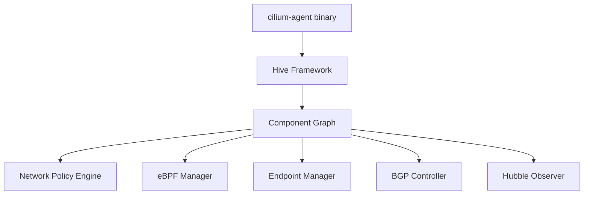

# How to Use cilium-agent

Author: [nawazdhandala](https://github.com/nawazdhandala)

Tags: Cilium, Kubernetes, CLI, cilium-agent, eBPF, Operations

Description: A guide to using the cilium-agent command and its subcommands for configuring, monitoring, and troubleshooting the Cilium network agent.

---

## Introduction

`cilium-agent` is the core binary that runs as the Cilium DaemonSet on each Kubernetes node. While it primarily runs as a daemon, it exposes a set of subcommands for configuration inspection, shell access, and dependency graph visualization through the Hive component framework.

Understanding these subcommands helps operators inspect agent configuration at runtime and diagnose initialization issues.

## Prerequisites

- Cilium DaemonSet running
- `kubectl` configured

## Access cilium-agent

The agent runs inside the Cilium DaemonSet pods. Access it via `kubectl exec`:

```bash
kubectl exec -n kube-system -it ds/cilium -- cilium-agent --help
```

## cilium-agent Subcommands

| Subcommand | Description |
|------------|-------------|
| `cilium-agent completion` | Generate shell completion scripts |
| `cilium-agent hive` | Hive component lifecycle commands |
| `cilium-agent hive dot-graph` | Visualize component dependencies |
| `cilium-agent shell` | Interactive shell for agent inspection |

## Architecture



## Generate Shell Completion

For bash:

```bash
# On local machine with cilium CLI
cilium-agent completion bash > /etc/bash_completion.d/cilium-agent

# Or for the current session
source <(cilium-agent completion bash)
```

For zsh:

```bash
cilium-agent completion zsh > "${fpath[1]}/_cilium-agent"
```

## Hive Dependency Graph

Visualize how Cilium components depend on each other:

```bash
kubectl exec -n kube-system ds/cilium -- \
  cilium-agent hive dot-graph > cilium-hive.dot

# Convert to SVG (requires graphviz)
dot -Tsvg cilium-hive.dot -o cilium-hive.svg
```

## Interactive Shell

Access the agent shell for live inspection:

```bash
kubectl exec -n kube-system ds/cilium -- cilium-agent shell
```

The shell provides access to the agent's internal state and allows running diagnostic commands interactively.

## View Agent Configuration at Runtime

```bash
kubectl exec -n kube-system ds/cilium -- \
  cilium-dbg config --all
```

## Check Agent Version

```bash
kubectl exec -n kube-system ds/cilium -- \
  cilium-agent --version
```

## Conclusion

The `cilium-agent` command provides access to configuration inspection, shell interaction, and the Hive component dependency graph. These tools are valuable for advanced debugging and understanding how Cilium's components interact at runtime.
