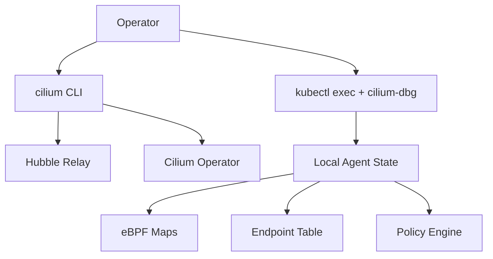

# How to Use Command Cheatsheet for Cilium

Author: [nawazdhandala](https://github.com/nawazdhandala)

Tags: Cilium, Kubernetes, CLI, Commands, Reference, Operations

Description: A practical reference guide for the most commonly used Cilium CLI commands for status checks, policy inspection, endpoint management, and troubleshooting.

---

## Introduction

Operating Cilium effectively requires familiarity with its CLI tools: `cilium` (the user-facing CLI), `cilium-dbg` (the debug CLI inside agent pods), and `cilium-bugtool` (for diagnostic data collection). These tools provide access to Cilium's internal state, policy engine, and eBPF maps.

This cheatsheet covers the commands most frequently used by platform engineers managing production Cilium deployments.

## Prerequisites

- Cilium installed and running
- `cilium` CLI installed locally
- `kubectl` configured for your cluster

## Cilium Status Commands

```bash
# Overall cluster status
cilium status

# Detailed status with component health
cilium status --verbose

# Check specific node
kubectl exec -n kube-system <cilium-pod> -- cilium-dbg status
```

## Architecture



## Endpoint Commands

```bash
# List all endpoints on current node
kubectl exec -n kube-system ds/cilium -- cilium-dbg endpoint list

# Get endpoint details
kubectl exec -n kube-system ds/cilium -- cilium-dbg endpoint get <id>

# Show endpoint health
kubectl exec -n kube-system ds/cilium -- cilium-dbg endpoint health
```

## Policy Commands

```bash
# Show compiled policy for an endpoint
kubectl exec -n kube-system ds/cilium -- cilium-dbg policy get

# Trace policy decision
kubectl exec -n kube-system ds/cilium -- \
  cilium-dbg policy trace --src-label app=client --dst-label app=server
```

## BPF Map Inspection

```bash
# List BPF maps
kubectl exec -n kube-system ds/cilium -- cilium-dbg bpf config list

# Inspect CT table
kubectl exec -n kube-system ds/cilium -- cilium-dbg bpf ct list

# Check load balancer services
kubectl exec -n kube-system ds/cilium -- cilium-dbg service list
```

## FQDN and DNS Commands

```bash
# View DNS cache
kubectl exec -n kube-system ds/cilium -- cilium-dbg fqdn cache list

# Lookup FQDN in cache
kubectl exec -n kube-system ds/cilium -- \
  cilium-dbg fqdn cache list | grep api.example.com
```

## BGP Commands (if enabled)

```bash
# Check BGP peers
kubectl exec -n kube-system ds/cilium -- cilium-dbg bgp peers

# View BGP routes
kubectl exec -n kube-system ds/cilium -- cilium-dbg bgp routes advertised
```

## Collect Diagnostics

```bash
# Run bugtool to collect all diagnostics
kubectl exec -n kube-system <cilium-pod> -- \
  cilium-bugtool --archivetype=tgz

# Copy the archive
kubectl cp kube-system/<cilium-pod>:/tmp/cilium-bugtool-<timestamp>.tar.gz ./bugtool.tar.gz
```

## Conclusion

The Cilium CLI toolset provides deep access to agent state, policy decisions, eBPF maps, and diagnostics. Keeping this cheatsheet handy allows rapid investigation of networking issues and reduces time-to-resolution for production incidents.
