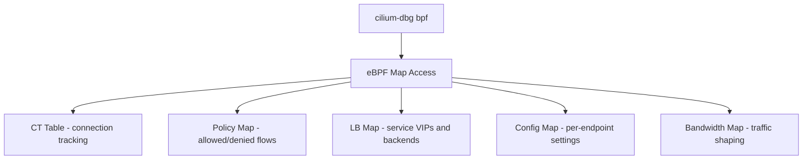

# How to Use cilium-dbg bpf

Author: [nawazdhandala](https://github.com/nawazdhandala)

Tags: Cilium, Kubernetes, CLI, EBPF, Debugging, Operations

Description: Use the cilium-dbg bpf subcommand to inspect eBPF maps, connection tracking tables, bandwidth settings, and BPF program configuration in Cilium.

---

## Introduction

`cilium-dbg bpf` is one of the most powerful debugging tools in Cilium's toolkit. It provides direct access to the eBPF maps that back Cilium's networking features: connection tracking, policy maps, load balancer state, endpoint configuration, and bandwidth management.

When network behavior doesn't match expectations, inspecting the eBPF maps directly reveals the ground truth about what Cilium's datapath is doing, independent of what the Kubernetes API shows.

## Prerequisites

- Cilium DaemonSet running
- `kubectl` with kube-system access

## cilium-dbg bpf Subcommands

| Subcommand | Description |
|------------|-------------|
| `bpf auth` | Mutual authentication state |
| `bpf bandwidth` | Bandwidth manager state |
| `bpf config` | BPF per-endpoint configuration |
| `bpf ct` | Connection tracking table |
| `bpf egress` | Egress gateway maps |
| `bpf endpoint` | Endpoint map |
| `bpf lb` | Load balancer maps |
| `bpf nat` | NAT table |
| `bpf policy` | Policy maps |

## Architecture



## Inspect Connection Tracking

```bash
# List all tracked connections
kubectl exec -n kube-system ds/cilium -- \
  cilium-dbg bpf ct list global | head -20

# List TCP connections to a specific destination
kubectl exec -n kube-system ds/cilium -- \
  cilium-dbg bpf ct list global | grep "10.0.0.5:443"
```

## Inspect Bandwidth Limits

```bash
kubectl exec -n kube-system ds/cilium -- \
  cilium-dbg bpf bandwidth list
```

Shows current egress bandwidth limits applied to endpoints.

## Inspect BPF Endpoint Configuration

```bash
# List per-endpoint BPF configuration
kubectl exec -n kube-system ds/cilium -- \
  cilium-dbg bpf config list

# Config for specific endpoint
kubectl exec -n kube-system ds/cilium -- \
  cilium-dbg bpf config list | grep <endpoint-id>
```

## Inspect Policy Maps

```bash
# View policy decisions for an endpoint
kubectl exec -n kube-system ds/cilium -- \
  cilium-dbg bpf policy get <endpoint-id>
```

## Inspect Load Balancer State

```bash
# List services in the LB map
kubectl exec -n kube-system ds/cilium -- \
  cilium-dbg service list

# List backends for a service
kubectl exec -n kube-system ds/cilium -- \
  cilium-dbg service list | grep <service-ip>
```

## Inspect Auth Map

When mutual auth is configured:

```bash
kubectl exec -n kube-system ds/cilium -- \
  cilium-dbg bpf auth list
```

## Conclusion

`cilium-dbg bpf` provides direct access to Cilium's eBPF maps, revealing the actual state of connection tracking, policy decisions, load balancer configuration, and bandwidth limits. This is the most reliable way to verify that Cilium's datapath is operating according to your configuration.
