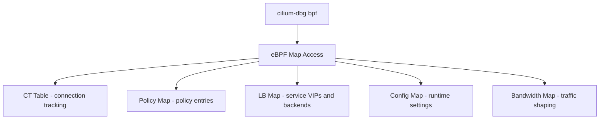

# How to Use cilium-dbg bpf

Author: [nawazdhandala](https://github.com/nawazdhandala)

Tags: Cilium, Kubernetes, CLI, eBPF, Debugging, Operation

Description: Use the cilium-dbg bpf subcommand to inspect eBPF maps, connection tracking tables, bandwidth settings, and BPF program configuration in Cilium.

---

## Introduction

`cilium-dbg bpf` is one of the most powerful debugging tools in Cilium's toolkit. It provides direct access to the eBPF maps that back Cilium's networking features: connection tracking, policy maps, load balancer state, endpoint state, and bandwidth management.

When network behavior doesn't match expectations, inspecting the eBPF maps directly reveals the ground truth about what Cilium's datapath is doing, independent of what the Kubernetes API shows.

## Prerequisites

- Cilium DaemonSet running
- `kubectl` with kube-system access

## cilium-dbg bpf Subcommands

| Subcommand | Description |
|------------|-------------|
| `bpf auth` | Mutual authentication state |
| `bpf bandwidth` | Bandwidth manager state |
| `bpf config` | BPF runtime configuration |
| `bpf ct` | Connection tracking table |
| `bpf egress` | Egress gateway maps |
| `bpf endpoint` | Endpoint map |
| `bpf lb` | Load balancer maps |
| `bpf nat` | NAT table |
| `bpf policy` | Policy maps |

## Architecture


```mermaid
flowchart TD
    A[cilium-dbg bpf] --> B[eBPF Map Access]
    B --> C[CT Table - connection tracking]
    B --> D[Policy Map - policy entries]
    B --> E[LB Map - service VIPs and backends]
    B --> F[Config Map - runtime settings]
    B --> G[Bandwidth Map - traffic shaping]
```

## Inspect Connection Tracking

```bash
# List all tracked connections

kubectl exec -n kube-system ds/cilium -- \
  cilium-dbg bpf ct list | head -20

# List TCP connections to a specific destination
kubectl exec -n kube-system ds/cilium -- \
  cilium-dbg bpf ct list | grep "10.0.0.5:443"
```

## Inspect Bandwidth Limits

```bash
kubectl exec -n kube-system ds/cilium -- \
  cilium-dbg bpf bandwidth list
```

Shows current egress bandwidth limits applied to endpoints.

## Inspect BPF Runtime Configuration

```bash
# List BPF runtime configuration
kubectl exec -n kube-system ds/cilium -- \
  cilium-dbg bpf config list

# Search for a specific runtime config entry
kubectl exec -n kube-system ds/cilium -- \
  cilium-dbg bpf config list | grep <config-key>
```

## Inspect Policy Maps

```bash
# Dump all policy maps
kubectl exec -n kube-system ds/cilium -- \
  cilium-dbg bpf policy get --all
```

## Inspect Load Balancer State

```bash
# List service frontends in the LB map
kubectl exec -n kube-system ds/cilium -- \
  cilium-dbg bpf lb list --frontends

# List backends in the LB map
kubectl exec -n kube-system ds/cilium -- \
  cilium-dbg bpf lb list --backends
```

## Inspect Auth Map

When mutual auth is configured:

```bash
kubectl exec -n kube-system ds/cilium -- \
  cilium-dbg bpf auth list
```

## Conclusion

`cilium-dbg bpf` provides direct access to Cilium's eBPF maps, revealing the actual state of connection tracking, policy entries, load balancer configuration, and bandwidth limits. This is the most reliable way to verify that Cilium's datapath is operating according to your configuration.
