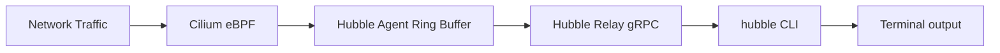

# How to Set Up Cilium Network Flows with the CLI

Author: [nawazdhandala](https://github.com/nawazdhandala)

Tags: Cilium, Kubernetes, Hubble, CLI, Network Flows, Observability

Description: Use the Hubble CLI to observe, filter, and analyze Cilium network flows for real-time traffic visibility and security auditing.

---

## Introduction

The `hubble observe` command is the primary tool for real-time network flow visibility in Cilium clusters. It provides access to Hubble's flow data stream, enabling operators to monitor traffic, debug connectivity issues, audit security policy enforcement, and understand application communication patterns.

Hubble flows contain rich metadata: source and destination pod names, namespaces, IPs, ports, protocols, verdict (allowed/dropped), and for L7-monitored traffic, HTTP method, path, and response code.

## Prerequisites

- Cilium with Hubble enabled
- `hubble` CLI installed
- Hubble relay deployed

## Install the hubble CLI

```bash
# Download the latest release
HUBBLE_VERSION=$(curl -s https://raw.githubusercontent.com/cilium/hubble/master/stable.txt)
curl -L --remote-name-all \
  https://github.com/cilium/hubble/releases/download/${HUBBLE_VERSION}/hubble-linux-amd64.tar.gz

tar xzvf hubble-linux-amd64.tar.gz
sudo mv hubble /usr/local/bin/
```

## Connect to Hubble Relay

```bash
cilium hubble port-forward &
hubble status
```

## Architecture



## Basic Flow Observation

```bash
# Watch all flows
hubble observe --follow

# Watch flows in a namespace
hubble observe --namespace production --follow

# Watch flows between specific pods
hubble observe \
  --from-pod production/frontend \
  --to-pod production/api \
  --follow
```

## Filter by Verdict

```bash
# Only dropped packets
hubble observe --verdict DROPPED

# Only forwarded packets
hubble observe --verdict FORWARDED

# Error flows
hubble observe --verdict ERROR
```

## Filter by Protocol

```bash
# HTTP traffic
hubble observe --protocol http

# DNS queries
hubble observe --protocol dns

# Only specific port
hubble observe --port 443
```

## JSON Output for Analysis

```bash
hubble observe --output json | \
  jq '{
    time: .time,
    src: .flow.source.pod_name,
    dst: .flow.destination.pod_name,
    verdict: .flow.verdict,
    reason: .flow.drop_reason_desc
  }'
```

## Count Flows by Source

```bash
hubble observe --namespace default \
  --since 5m --output json | \
  jq -r '.flow.source.pod_name' | sort | uniq -c | sort -rn
```

## HTTP-Specific Filters

```bash
# HTTP errors
hubble observe --http-status-code 500

# Specific HTTP method
hubble observe --http-method POST

# Specific URL path
hubble observe --http-path "/api/v1/users"
```

## Conclusion

The `hubble observe` CLI provides comprehensive real-time visibility into Cilium network flows. By combining verdict, protocol, pod, and namespace filters, operators can quickly identify connectivity issues, monitor security policy enforcement, and audit traffic patterns in production clusters.
