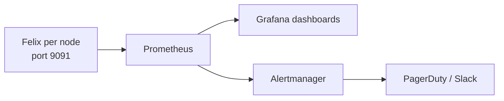

# How to Use Felix Metrics in Calico

Author: [nawazdhandala](https://github.com/nawazdhandala)

Tags: Calico, Kubernetes, Networking, Observability

Description: Use Felix Prometheus metrics to monitor policy enforcement performance, detect iptables programming failures, and track BGP peer state changes across all Calico-managed nodes.

---

## Introduction

Felix metrics are organized into four operational groups: policy calculation metrics (felix_calc_* - how fast Felix processes policy changes), dataplane metrics (felix_int_dataplane_* - iptables/eBPF programming performance), IPAM metrics (felix_ipam_* - IP allocation activity), and BGP metrics (felix_bpf_*/felix_cluster_* - peer connectivity). Understanding which metric to use for each operational question is the key to effective monitoring.

## Key Commands

```bash
# Enable Felix metrics (if not already enabled)
kubectl patch felixconfiguration default   --type=merge   -p '{"spec":{"prometheusMetricsEnabled":true,"prometheusMetricsPort":9091}}'

# Test Felix metrics endpoint
CALICO_POD=$(kubectl get pods -n calico-system -l app=calico-node   -o jsonpath='{.items[0].metadata.name}')

kubectl exec -n calico-system "${CALICO_POD}" -c calico-node --   wget -qO- http://localhost:9091/metrics | head -30

# Key Felix metrics to check:
kubectl exec -n calico-system "${CALICO_POD}" -c calico-node --   wget -qO- http://localhost:9091/metrics | grep -E   "^felix_int_dataplane_failures|^felix_calc_graph|^felix_ipam_blocks"
```

## ServiceMonitor for Felix

```yaml
apiVersion: monitoring.coreos.com/v1
kind: ServiceMonitor
metadata:
  name: calico-felix-metrics
  namespace: calico-system
spec:
  selector:
    matchLabels:
      app: calico-node
  endpoints:
    - port: http-metrics
      path: /metrics
      interval: 30s
```

## Architecture



## Conclusion

Felix metrics provide the deepest operational visibility into the Calico data plane. Enable the Prometheus endpoint via FelixConfiguration, configure a ServiceMonitor to scrape all calico-node pods, and build dashboards focused on dataplane failures and policy calculation latency. These two metric categories detect the most impactful Calico failure modes before they cause visible pod connectivity issues.
