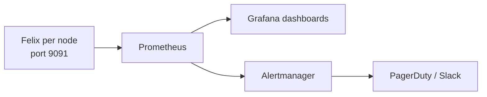

# How to Use Felix Metrics in Calico

Author: [nawazdhandala](https://github.com/nawazdhandala)

Tags: Calico, Kubernetes, Networking, Observability

Description: Use Felix Prometheus metrics to monitor policy enforcement performance, detect iptables programming failures, and track BGP peer state changes across all Calico-managed nodes.

---

## Introduction

Felix metrics are organized into operational groups: calculation graph metrics (felix_calc_* - how fast Felix processes datastore updates), dataplane metrics (felix_int_dataplane_* - dataplane programming performance), iptables metrics (felix_iptables_* - iptables programming activity), BPF dataplane metrics (felix_bpf_* - eBPF dataplane state), and cluster state metrics (felix_cluster_* - Calico resource counts). Understanding which metric to use for each operational question is the key to effective monitoring.

## Key Commands

```bash
# Enable Felix metrics (if not already enabled)

kubectl patch felixconfiguration default   --type=merge   -p '{"spec":{"prometheusMetricsEnabled":true,"prometheusMetricsPort":9091}}'

# Test Felix metrics endpoint
CALICO_POD=$(kubectl get pods -n calico-system -l k8s-app=calico-node   -o jsonpath='{.items[0].metadata.name}')

kubectl exec -n calico-system "${CALICO_POD}" -c calico-node --   wget -qO- http://localhost:9091/metrics | head -30

# Key Felix metrics to check:
kubectl exec -n calico-system "${CALICO_POD}" -c calico-node --   wget -qO- http://localhost:9091/metrics | grep -E   "^felix_int_dataplane_failures|^felix_calc_graph"
```

## ServiceMonitor for Felix

```yaml
apiVersion: v1
kind: Service
metadata:
  name: felix-metrics-svc
  namespace: calico-system
  labels:
    app: calico-felix-metrics
spec:
  clusterIP: None
  selector:
    k8s-app: calico-node
  ports:
    - name: http-metrics
      port: 9091
      targetPort: 9091
---
apiVersion: monitoring.coreos.com/v1
kind: ServiceMonitor
metadata:
  name: calico-felix-metrics
  namespace: calico-system
spec:
  selector:
    matchLabels:
      app: calico-felix-metrics
  endpoints:
    - port: http-metrics
      path: /metrics
      interval: 30s
```

## Architecture


```mermaid
flowchart LR
    A[Felix per node\nport 9091] --> B[Prometheus]
    B --> C[Grafana dashboards]
    B --> D[Alertmanager]
    D --> E[PagerDuty / Slack]
```

## Conclusion

Felix metrics provide the deepest operational visibility into the Calico data plane. Enable the Prometheus endpoint via FelixConfiguration, configure a ServiceMonitor to scrape all calico-node pods, and build dashboards focused on dataplane failures and policy calculation latency. These two metric categories detect the most impactful Calico failure modes before they cause visible pod connectivity issues.
