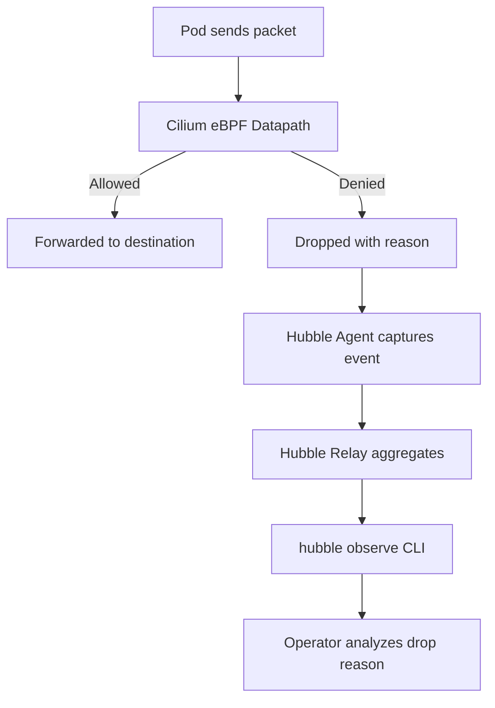

# How to Use Hubble to Find Why Traffic Was Dropped in Cilium

Author: [nawazdhandala](https://github.com/nawazdhandala)

Tags: Cilium, Kubernetes, Hubble, Observability, Troubleshooting, Network Policy

Description: Use Hubble's flow observability to identify the exact reason for dropped traffic in Cilium, including policy denials, route failures, and endpoint issues.

---

## Introduction

When pods cannot communicate, the traditional debugging approach of tcpdump and iptables rule inspection no longer applies in a Cilium environment. Hubble provides a purpose-built alternative: it captures every network flow decision made by Cilium's eBPF datapath, including the specific reason each packet was dropped.

Hubble's drop reasons map directly to Cilium's internal policy enforcement categories. This means you can pinpoint whether a drop was caused by a network policy, an identity mismatch, a route failure, or an endpoint not ready condition-without any additional tooling.

## Prerequisites

- Cilium with Hubble enabled
- `hubble` CLI installed
- Hubble relay deployed in kube-system

## Enable Hubble (if not enabled)

```bash
helm upgrade cilium cilium/cilium \
  --namespace kube-system \
  --reuse-values \
  --set hubble.enabled=true \
  --set hubble.relay.enabled=true \
  --set hubble.ui.enabled=true
```

## Connect to Hubble Relay

```bash
cilium hubble port-forward &
hubble status
```

## Architecture



## Find All Dropped Flows

```bash
hubble observe --verdict DROPPED --follow
```

## Filter Drops by Namespace and Pod

```bash
hubble observe \
  --namespace <namespace> \
  --from-pod <pod-name> \
  --verdict DROPPED
```

## Understand Drop Reasons

| Drop Reason | Meaning |
|-------------|---------|
| `POLICY_DENIED` | A network policy blocked the traffic |
| `ENDPOINT_NOT_FOUND` | Destination pod not registered in Cilium |
| `NO_TUNNEL_OR_ROUTE` | Missing route to destination |
| `INVALID_SOURCE_IP` | Source IP not matching endpoint identity |
| `UNSUPPORTED_L2_PROTOCOL` | Layer 2 protocol not supported |

## Example: Find Policy Denials

```bash
hubble observe \
  --verdict DROPPED \
  --since 10m \
  | grep "POLICY_DENIED"
```

## Trace Specific Traffic

```bash
hubble observe \
  --from-pod default/my-app \
  --to-pod default/api-service \
  --follow
```

## Export Drop Events for Analysis

```bash
hubble observe --verdict DROPPED --output json | \
  jq '.flow | {src: .source.pod_name, dst: .destination.pod_name, reason: .drop_reason_desc}'
```

## Conclusion

Hubble transforms dropped traffic debugging from guesswork to precision. By using `hubble observe` with verdict filters and drop reason inspection, you can identify the exact policy or datapath condition causing connectivity failures within seconds, rather than spending hours analyzing iptables chains or eBPF maps manually.
