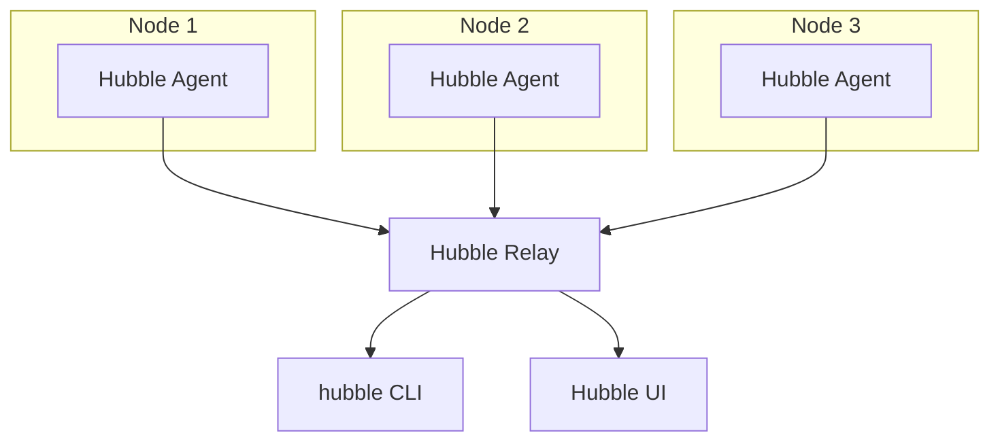

# How to Use Hubble Relay for Cluster-Wide Flow Searches in Cilium

Author: [nawazdhandala](https://github.com/nawazdhandala)

Tags: Cilium, Kubernetes, Hubble, Observability, Networking, EBPF

Description: Use Hubble Relay to aggregate and search network flows across all nodes in a Cilium cluster, enabling cluster-wide traffic analysis and policy debugging.

---

## Introduction

Hubble is deployed as a DaemonSet, meaning each node captures only its own flows. Hubble Relay aggregates these node-level streams into a single cluster-wide view, allowing operators to search for flows regardless of which node originated them.

This is particularly valuable when debugging intermittent issues where the affected pod may schedule on any node, or when analyzing traffic patterns across the entire cluster for security auditing.

This guide covers deploying Hubble Relay, using it for cluster-wide searches, and building useful query patterns.

## Prerequisites

- Cilium with Hubble enabled
- `hubble` CLI installed

## Deploy Hubble Relay

```bash
helm upgrade cilium cilium/cilium \
  --namespace kube-system \
  --reuse-values \
  --set hubble.relay.enabled=true \
  --set hubble.relay.service.type=ClusterIP
```

## Connect hubble CLI to Relay

```bash
cilium hubble port-forward &
sleep 2
hubble status
```

Expected output:

```plaintext
Healthcheck (via localhost:4245): Ok
Current/Max Flows: 8192/8192
Flows/s: 47.23
Connected Nodes: 5/5
```

## Architecture



## Cluster-Wide Flow Searches

Find all flows to a specific service across the cluster:

```bash
hubble observe --to-service default/api-service --follow
```

Find flows from a specific namespace to external destinations:

```bash
hubble observe \
  --from-namespace production \
  --to-ip 0.0.0.0/0 \
  --not-to-namespace production \
  --since 5m
```

## Search for Specific Protocols

Find all DNS queries in the cluster:

```bash
hubble observe --protocol DNS --since 1m
```

Find HTTP traffic returning errors:

```bash
hubble observe --http-status-code 500 --since 10m
```

## Export for Analysis

```bash
hubble observe --output json --since 1h | \
  jq 'select(.flow.verdict == "DROPPED") |
    {time: .time, src: .flow.source.pod_name,
     dst: .flow.destination.pod_name,
     reason: .flow.drop_reason_desc}' > drops.json
```

## Use Hubble UI for Visual Analysis

```bash
# Port-forward Hubble UI
kubectl port-forward -n kube-system svc/hubble-ui 12000:80 &
open http://localhost:12000
```

## Conclusion

Hubble Relay enables cluster-wide network flow observability by aggregating per-node Hubble streams. With the relay deployed, the `hubble observe` CLI provides a single query interface for flows across all nodes, making it practical to debug network issues without knowing which node is involved.
