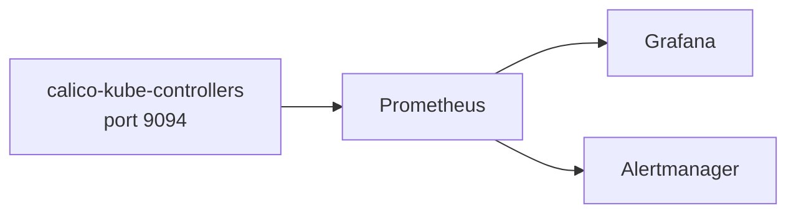

# How to Use Calico Kube-Controllers Metrics

Author: [nawazdhandala](https://github.com/nawazdhandala)

Tags: Calico, Kubernetes, Networking, Observability

Description: Use Calico kube-controllers Prometheus metrics to monitor policy distribution and synchronization health.

---

## Introduction

Calico kube-controllers exposes Prometheus metrics on port 9094 that provide visibility into IPAM allocation state and process health. These metrics are useful for monitoring the health of Calico's control plane in large clusters.

## Enable Metrics Collection

```bash
# Test kube-controllers metrics endpoint

POD=$(kubectl get pods -n calico-system -l k8s-app=calico-kube-controllers   -o jsonpath='{.items[0].metadata.name}')

kubectl exec -n calico-system "${POD}" --   wget -qO- http://localhost:9094/metrics | head -30
```

## ServiceMonitor

```yaml
apiVersion: monitoring.coreos.com/v1
kind: ServiceMonitor
metadata:
  name: calico-kube-controllers-metrics
  namespace: calico-system
spec:
  selector:
    matchLabels:
      k8s-app: calico-kube-controllers
  endpoints:
    - port: metrics-port
      path: /metrics
      interval: 30s
```

## Alert Rules

```yaml
apiVersion: monitoring.coreos.com/v1
kind: PrometheusRule
metadata:
  name: calico-kube-controllers-alerts
  namespace: calico-system
spec:
  groups:
    - name: calico.kube-controllers
      rules:
        - alert: CalicoKubeControllersMetricsDown
          expr: up{job="calico-kube-controllers-metrics"} == 0
          for: 5m
          annotations:
            summary: "Calico kube-controllers metrics endpoint is unreachable"
```

## Architecture



## Conclusion

Calico kube-controllers metrics provide visibility into IPAM allocation state and kube-controllers process health. Enable metrics via ServiceMonitor, build dashboards focused on key kube-controllers health indicators, and alert on metrics endpoint availability. These metrics complement Felix per-node metrics to provide complete Calico observability.
