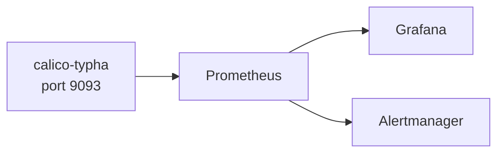

# How to Use Calico Typha Metrics

Author: [nawazdhandala](https://github.com/nawazdhandala)

Tags: Calico, Kubernetes, Networking, Observability

Description: Use Calico typha Prometheus metrics to monitor policy distribution and synchronization health.

---

## Introduction

Calico typha exposes Prometheus metrics on port 9093 that provide visibility into the policy distribution layer. These metrics are essential for monitoring the health of Calico's control plane in large clusters.

## Enable Metrics Collection

```bash
# Test typha metrics endpoint
POD=$(kubectl get pods -n calico-system -l k8s-app=calico-typha   -o jsonpath='{.items[0].metadata.name}')

kubectl exec -n calico-system "${POD}" --   wget -qO- http://localhost:9093/metrics | head -30
```

## ServiceMonitor

```yaml
apiVersion: monitoring.coreos.com/v1
kind: ServiceMonitor
metadata:
  name: calico-typha-metrics
  namespace: calico-system
spec:
  selector:
    matchLabels:
      k8s-app: calico-typha
  endpoints:
    - port: metrics
      path: /metrics
      interval: 30s
```

## Alert Rules

```yaml
apiVersion: monitoring.coreos.com/v1
kind: PrometheusRule
metadata:
  name: calico-typha-alerts
  namespace: calico-system
spec:
  groups:
    - name: calico.typha
      rules:
        - alert: CalicoTyphaMetricsDown
          expr: up{job="calico-typha-metrics"} == 0
          for: 5m
          annotations:
            summary: "Calico typha metrics endpoint is unreachable"
```

## Architecture



## Conclusion

Calico typha metrics provide visibility into the typha distribution layer. Enable metrics via ServiceMonitor, build dashboards focused on key typha health indicators, and alert on metrics endpoint availability and key performance thresholds. These metrics complement Felix per-node metrics to provide complete Calico observability.
