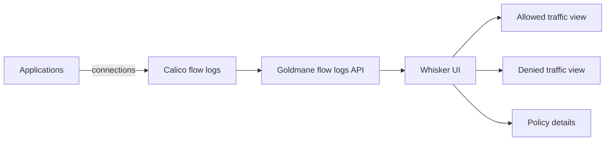

# How to Use Whisker in Calico

Author: [nawazdhandala](https://github.com/nawazdhandala)

Tags: Calico, Kubernetes, Networking, Observability

Description: Use Calico Whisker to investigate pod connectivity issues, identify which network policies are denying traffic, and understand traffic patterns across your Kubernetes cluster.

---

## Introduction

Whisker's primary value is in troubleshooting network policy issues. The denied traffic view shows which source was trying to connect to which destination, which policies interacted with the flow, and the time window for the flow log. This information typically takes 30+ minutes to gather manually through logs - Whisker surfaces it in seconds through a visual interface.

## Key Operations

```bash
# Verify Whisker is running

kubectl get tigerastatus whisker goldmane
kubectl get pods -n calico-system | grep -E 'whisker|goldmane'

# Access Whisker UI
kubectl port-forward -n calico-system service/whisker 8081:8081
# Open: http://localhost:8081

# Check Whisker logs for issues
kubectl logs -n calico-system deployment/whisker --tail=50

# Check that the flow logs API backing Whisker is available
kubectl get goldmane.operator.tigera.io default
```

## Architecture



## Common Whisker Queries

```plaintext
# In Whisker UI - common investigation patterns:

# Find all denied connections to a destination pod:
# Filter: dest_name=<pod-name>, action=deny

# Find all traffic from a specific pod:
# Filter: source_name=<pod-name>

# Find recently started connections:
# Sort by: start_time descending

# Find policy drop sources:
# Filter: action=deny, group by: source_namespace
```

## Conclusion

Whisker provides the fastest path to understanding Calico network policy behavior in a running cluster. The denied traffic view replaces hours of log analysis with seconds of UI interaction. Validate Whisker periodically by cross-checking its view against known application connection patterns - this ensures the Goldmane and Whisker observability pipeline is functioning correctly before you rely on it during an incident.
