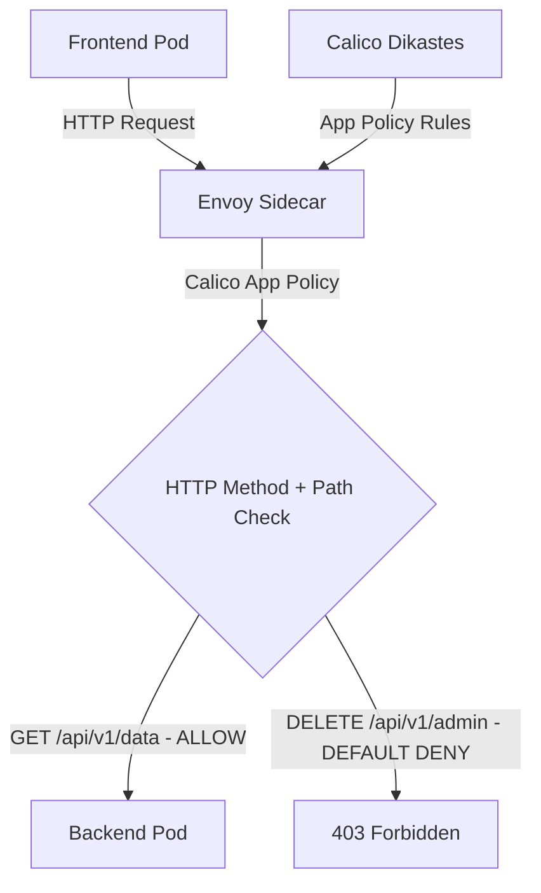

# How to Validate Application-Layer Policy with Calico and Istio Before Production

Author: [nawazdhandala](https://github.com/nawazdhandala)

Tags: Calico, Kubernetes, Network Policy, Istio, Application Layer, Security

Description: Validate Calico application-layer network policies using Istio integration for HTTP method and path-based access control.

---

## Introduction

Application-Layer Policy with Calico and Istio combines Calico's network-layer enforcement with Istio's application-layer visibility. This powerful combination lets you write policies that reference HTTP attributes - methods and paths - in addition to network-level properties like IP addresses and ports.

Calico's `projectcalico.org/v3` NetworkPolicy with HTTP match criteria (available with Istio integration) allows you to write rules that are evaluated by Istio's Envoy sidecar proxies rather than only at the network layer. This enables fine-grained control like "allow GET requests to /api/health while unmatched requests such as POST requests to /api/admin receive a 403 response."

This guide covers validate App-Layer Policy using Calico and Istio together.

## Prerequisites

- Kubernetes cluster with a Calico version that supports application layer policy and Istio installed
- Calico-Istio integration configured with the Dikastes injection template
- `kubectl` installed
- Workloads with Istio and Dikastes sidecar injection enabled

## Core Configuration

```yaml
apiVersion: projectcalico.org/v3
kind: NetworkPolicy
metadata:
  name: validate-app-layer-policy
  namespace: production
spec:
  order: 100
  selector: app == 'backend-api'
  ingress:
    - action: Allow
      source:
        selector: app == 'frontend'
      http:
        methods:
          - GET
          - POST
        paths:
          - exact: /api/v1/data
          - prefix: /api/v1/public
  types:
    - Ingress
```

## Istio + Calico Setup

```bash
# Verify Calico-Istio integration

kubectl get pods -n calico-system
kubectl get configmap -n istio-system istio-sidecar-injector -o yaml | grep "dikastes:"

# Enable sidecar injection for namespace
kubectl label namespace production istio-injection=enabled --overwrite

# Ensure the backend pods get both Envoy and Dikastes sidecars
kubectl patch deployment backend-api -n production --type merge -p '{"spec":{"template":{"metadata":{"annotations":{"inject.istio.io/templates":"sidecar,dikastes"}}}}}'
```

## Test Application-Layer Policy

```bash
# Test allowed method
kubectl exec -n production frontend-pod -- curl -X GET http://backend-api:8080/api/v1/data
echo "GET /api/v1/data (should pass): $?"

# Test unmatched method/path
kubectl exec -n production frontend-pod -- curl -X DELETE http://backend-api:8080/api/v1/admin
echo "DELETE /api/v1/admin (should be denied by default): $?"
```

## Architecture



## Conclusion

Application-Layer Policy with Calico and Istio provides fine-grained network security in Kubernetes, combining network-layer enforcement with application-layer policy evaluation. By filtering on HTTP methods and paths, you can implement access controls that are impossible with pure network-layer policies. Ensure your Calico-Istio integration is properly configured and test both allowed and denied request patterns to verify your application-layer policies are working correctly.
