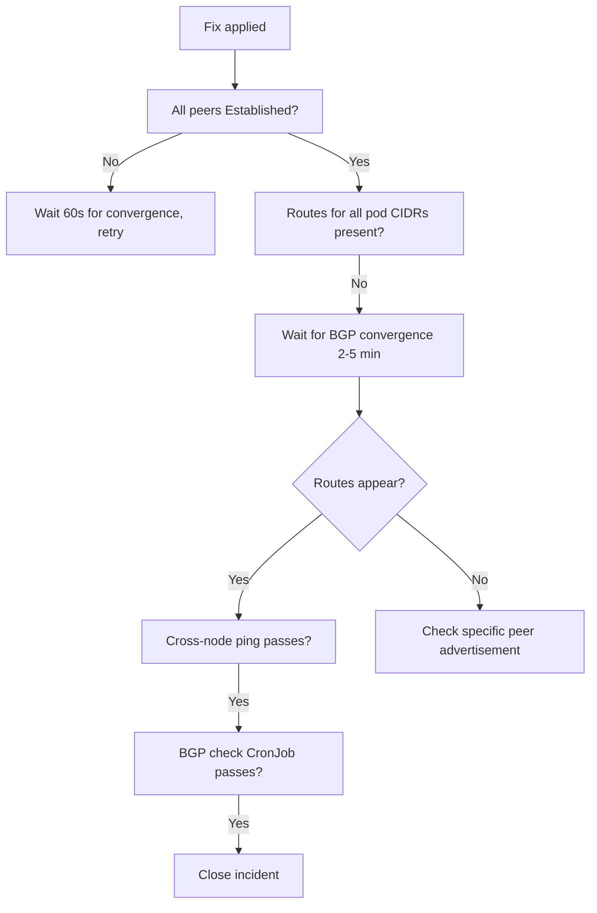

# How to Validate Resolution of BGP Peer Not Established in Calico

Author: [nawazdhandala](https://github.com/nawazdhandala)

Tags: Calico, Kubernetes, Networking, Troubleshooting

Description: Validate that BGP peer sessions are fully established in Calico by confirming peer state, route exchange, and cross-node pod connectivity.

---

## Introduction

Validating BGP peer session restoration requires confirming not just that peers show Established, but that route exchange is actually working — routes for remote pod CIDRs must appear in the routing table. After a BGP session dropout, there may be a brief convergence delay before all routes are re-advertised and installed.

## Symptoms

- Peers show Established but routes still missing
- BGP reconvergence delay after session restored

## Root Causes

- Routes not yet re-advertised after session restored
- Multiple nodes affected but only one fixed

## Diagnosis Steps

```bash
calicoctl node status
ip route show | grep bird | head -10
```

## Solution

**Validation Step 1: All peers show Established**

```bash
calicoctl node status | grep -v "Established" | grep -E "Idle|Active|Connect"
# Expected: empty - no non-Established peers
```

**Validation Step 2: Routes are present for all nodes**

```bash
# Check routes for each node's pod CIDR
for NODE in $(kubectl get nodes -o jsonpath='{.items[*].metadata.name}'); do
  POD_CIDR=$(kubectl get node $NODE -o jsonpath='{.spec.podCIDR}')
  echo -n "$NODE ($POD_CIDR): "
  ip route show | grep "$POD_CIDR" | head -1 || echo "MISSING ROUTE"
done
```

**Validation Step 3: Cross-node pod connectivity test**

```bash
kubectl run bgp-val-src --image=busybox --restart=Never -- sleep 120
kubectl run bgp-val-dst --image=busybox --restart=Never -- sleep 120
kubectl wait pod/bgp-val-src pod/bgp-val-dst --for=condition=Ready --timeout=60s

DST_IP=$(kubectl get pod bgp-val-dst -o jsonpath='{.status.podIP}')
kubectl exec bgp-val-src -- ping -c 3 $DST_IP && echo "PASS" || echo "FAIL"

kubectl delete pod bgp-val-src bgp-val-dst
```

**Validation Step 4: BGP check CronJob passes**

```bash
kubectl create job bgp-validate --from=cronjob/bgp-peer-check -n kube-system
kubectl wait job/bgp-validate -n kube-system --for=condition=complete --timeout=60s
kubectl logs -n kube-system job/bgp-validate
```



## Prevention

- Allow 5 minutes for BGP reconvergence after session restoration before validating routes
- Validate routes from all nodes, not just the affected one
- Include cross-node ping as the final validation step

## Conclusion

Validating BGP peer restoration requires all peers showing Established, routes for all node pod CIDRs present in the routing table, successful cross-node pod ping, and the BGP check CronJob passing. Allow time for BGP reconvergence after session restoration before declaring validation complete.
