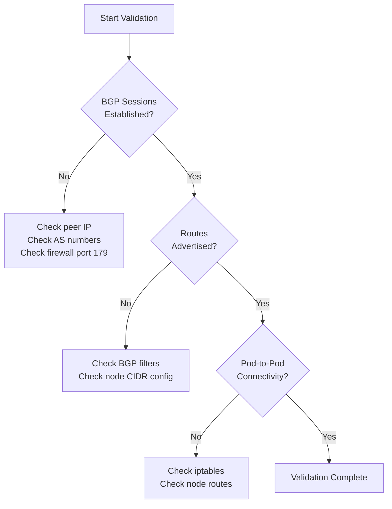

# How to Validate BGP Peering in Calico

Author: [nawazdhandala](https://github.com/nawazdhandala)

Tags: Calico, Kubernetes, BGP, Networking, CNI

Description: Learn how to validate BGP peering health in Calico by checking session state, route advertisements, and end-to-end pod connectivity.

---

## Introduction

After configuring BGP peering in Calico, validating that sessions are established and routes are correctly advertised is critical before relying on the network for production workloads. BGP sessions can silently fail to establish due to mismatched AS numbers, incorrect peer IPs, or firewall rules blocking TCP port 179.

Validation goes beyond checking that sessions are in the "Established" state. You need to confirm that the correct routes are being advertised, that pods can communicate across nodes, and that external systems can reach pod IPs as expected.

This guide covers the complete validation workflow: from checking BGP session state to verifying route propagation and testing pod-to-pod connectivity across different nodes.

## Prerequisites

- Calico installed with BGP mode enabled
- `calicoctl` configured against the cluster
- `kubectl` with cluster-admin access
- At least two nodes with pods scheduled

## Check BGP Session State

The first validation step is confirming that BGP sessions are in the `Established` state:

```bash
calicoctl node status
```

For a specific node, exec into the Calico node pod:

```bash
NODE_POD=$(kubectl get pod -n calico-system -l k8s-app=calico-node \
  --field-selector spec.nodeName=<node-name> -o name | head -1)
kubectl exec -n calico-system ${NODE_POD} -- birdcl show protocols
```

Expected output:

```
Name       Proto      Table      State  Since         Info
Kernel1    Kernel     master     up     14:23:00
BGP_10_0_0_2 BGP      master     up     14:24:00      Established
```

## Verify Route Advertisements

Confirm that routes from this node are being advertised to peers:

```bash
kubectl exec -n calico-system ${NODE_POD} -- birdcl show route
```

Check that the pod CIDR for each node appears in the routing table:

```bash
kubectl exec -n calico-system ${NODE_POD} -- birdcl show route export BGP_10_0_0_2
```

On the Kubernetes node itself, check the Linux routing table to confirm pod routes are present:

```bash
ip route | grep -E 'cali|tunl|vxlan'
```

## Validate Pod-to-Pod Connectivity

Deploy test pods on different nodes and test connectivity:

```bash
kubectl run test-pod-1 --image=busybox --overrides='{"spec":{"nodeName":"node-1"}}' \
  -- sleep 3600
kubectl run test-pod-2 --image=busybox --overrides='{"spec":{"nodeName":"node-2"}}' \
  -- sleep 3600

POD2_IP=$(kubectl get pod test-pod-2 -o jsonpath='{.status.podIP}')
kubectl exec test-pod-1 -- ping -c 3 ${POD2_IP}
```

## Validate BGP Configuration Resources

Check that all BGP peer resources are correctly configured:

```bash
calicoctl get bgppeers -o yaml
calicoctl get bgpconfiguration -o yaml
```

Verify node AS numbers match expectations:

```bash
calicoctl get nodes -o yaml | grep -A5 bgp
```

## Validation Flow



## Conclusion

Validating BGP peering in Calico requires checking multiple layers: session state, route advertisements, and actual pod connectivity. Using `birdcl` for BGP-level inspection and standard Linux networking tools for route verification gives you a complete picture of the network health. Automate these checks in your CI/CD pipeline or monitoring system to catch BGP peering regressions early.
