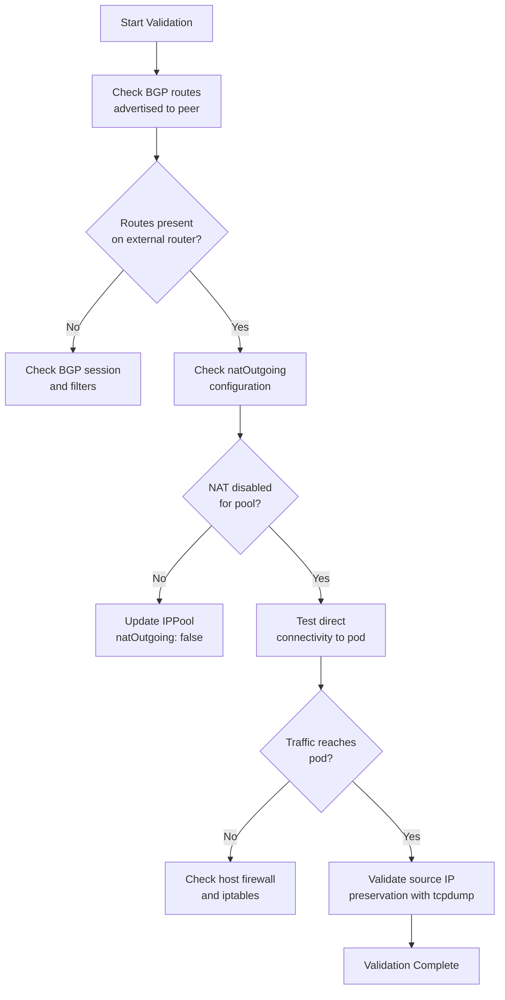

# How to Validate BGP to Workload Connectivity in Calico

Author: [nawazdhandala](https://github.com/nawazdhandala)

Tags: Calico, Kubernetes, BGP, Networking, Validation

Description: Validate that BGP-advertised pod routes enable direct workload connectivity by verifying route propagation, NAT behavior, and end-to-end packet flows.

---

## Introduction

Validating BGP-to-workload connectivity in Calico goes beyond confirming that BGP sessions are established. You need to verify that pod IP routes are correctly propagated to external routers, that NAT is not inadvertently applied (which would break return routing), and that packets arriving at pods carry the correct source IP from external clients.

A common mistake is deploying workloads expecting direct pod IP reachability, only to discover that `natOutgoing: true` on the IP pool is masquerading the source IP on outbound traffic. While this does not prevent inbound connectivity, it means pods cannot see the real client IP — a problem for applications that need to log or rate-limit based on source address.

This guide covers the complete validation workflow for BGP-to-workload connectivity in Calico.

## Prerequisites

- Calico BGP mode with at least one external BGP peer
- Test workloads running in the cluster
- Access to the external BGP peer for route verification

## Validate Route Propagation

Check that pod block routes appear in the BGP routing table on the external peer:

```bash
# On Calico node: check what routes are being advertised
NODE_POD=$(kubectl get pod -n calico-system -l k8s-app=calico-node -o name | head -1)
kubectl exec -n calico-system ${NODE_POD} -- birdcl show route export BGP_<peer_ip>

# Check kernel route table on node
ip route | grep -E '^10\.'
```

## Validate NAT Configuration

Confirm NAT is disabled for the pod pool (required for direct pod access):

```bash
calicoctl get ippools -o yaml | grep -A3 natOutgoing
```

Verify no SNAT rules are applied to pod traffic:

```bash
iptables -t nat -L cali-nat-outgoing -n
```

For pods on this pool, the output should show no MASQUERADE rules for the pod CIDR.

## End-to-End Packet Capture

Deploy a test pod and capture packets to verify source IP preservation:

```bash
kubectl run nettest --image=nicolaka/netshoot -- sleep 3600
POD_IP=$(kubectl get pod nettest -o jsonpath='{.status.podIP}')

# Start packet capture on the pod
kubectl exec -it nettest -- tcpdump -i eth0 -n 'tcp port 80'
```

From an external host, connect to the pod:

```bash
curl http://${POD_IP}:80
```

In the tcpdump output, verify the source IP is the actual client IP, not a NAT address.

## Validate Return Path Routing

Verify that return traffic from the pod reaches the external client by checking routing on the pod:

```bash
kubectl exec -it nettest -- ip route
# Should show default route via the node gateway
# Pod's return packets go through node, then BGP routes guide them externally
```

## Connectivity Validation Checklist



## Conclusion

Validating BGP-to-workload connectivity requires checking route propagation, NAT configuration, and actual packet flows. Use `birdcl` on Calico nodes to verify what routes are advertised, confirm `natOutgoing: false` on the relevant IP pool, and use `tcpdump` inside pods to verify that external clients appear with their real IP addresses. These validations together confirm that your BGP-to-workload connectivity is functioning correctly.
